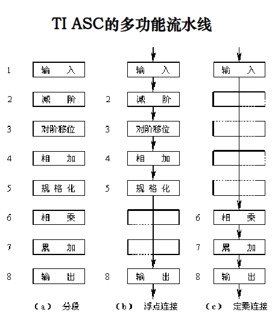
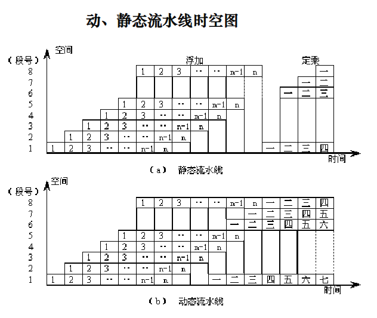

<!-- @import "[TOC]" {cmd="toc" depthFrom=1 depthTo=6 orderedList=false} -->
<!-- code_chunk_output -->

- [3.1 流水线概述](#31-流水线概述)
  - [3.1.1 流水线基本概念](#311-流水线基本概念)
  - [3.1.2 流水线分类](#312-流水线分类)
- [3.2 MIPS 基本流水线](#32-mips-基本流水线)
  - [3.1.2 基本 MIPS 流水线](#312-基本-mips-流水线)

<!-- /code_chunk_output -->

## 3.1 流水线概述

### 3.1.1 流水线基本概念

1. 例子: 略
2. 计算机中的流水线
   - 指令流水线
   - 功能部件流水线
3. 流水技术的定义
    : 将一重复的时序过程分解为若干子过程, 每个子过程都可有效地在其专用功能段上与其它子过程同时执行, 这种技术称为流水技术.
4. 时空图: 从时间和空间两个方面描述流水线的工作流程, 横坐标表示时间, 纵坐标表示空间.
5. 流水线的特点:
   1. 流水过程由多个相关的子过程组成, 这些子过程称为流水线的 "级" 或 "段". 段的数目称为流水线的 "深度".
   2. 每个子过程由专用的功能段实现.
   3. 各功能段的时间应基本相等, 通常为 1 个时钟周期 (1拍).
   4. 流水线需要经过一定的通过时间才能稳定.
   5. 流水技术适合于大量重复的时序过程.

### 3.1.2 流水线分类

1. 单功能流水线和多功能流水线
   - 单功能流水线, 是指只能完成一种固定功能的流水线.
   - 多功能流水线, 是指各段可以进行不同的连接, 从而完成不同的功能.  
    例如: TI ASC 多功能流水线
    
2. 静态流水线和动态流水线
   - 静态流水线, 是指同一时间内, 流水线的各段只能按同一种功能的连接方式工作, 适合处理一串相同的运算操作.
   - 动态流水线, 是指在同一时间内, 当某些段正在实现某种运算时, 另一些段却在实现另一种运算, 会使流水线的控制变得很复杂.
    
3. 部件级, 处理机级及处理机间流水线
   - 部件级流水线, 又叫运算操作流水线, 是把处理机的算术逻辑部件分段, 使得各种数据类型的操作能够进行流水.
   - 处理机级流水线, 又叫指令流水线, 是把解释指令的过程按照流水方式进行处理.
   - 处理机间流水线, 又叫宏流水线, 是由两个以上的处理机串行地对同一数据流进行处理, 每个处理机完成一项任务.
4. 标量流水处理机和向量流水处理机
   - 标量流水处理机, 是指处理机不具有向量数据表示, 仅对标量数据进行流水处理.
   - 向量流水处理机, 是指处理机具有向量数据表示, 并通过向量指令对向量的各元素进行处理.
5. 线性流水线和非线性流水线
   - 线性流水线是指流水线的各段串行连接, 没有反馈回路.
   - 非线性流水线是指流水线中除由串行连接的通路外, 还有反馈回路.

## 3.2 MIPS 基本流水线

### 3.1.2 基本 MIPS 流水线
