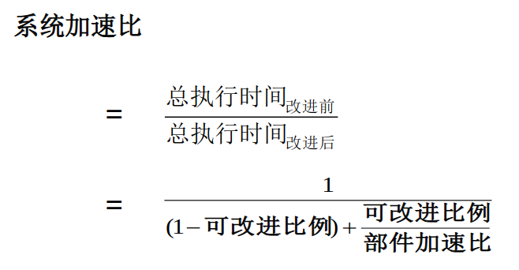

<!-- @import "[TOC]" {cmd="toc" depthFrom=1 depthTo=6 orderedList=false} -->
<!-- code_chunk_output -->

- [1.2 计算机体系结构的发展](#12-计算机体系结构的发展)
  - [1.2.6 并行处理技术的发展](#126-并行处理技术的发展)
- [1.3 计算机系统设计和分析](#13-计算机系统设计和分析)
  - [1.3.1 成本与价格](#131-成本与价格)
  - [1.3.2 基准测试程序](#132-基准测试程序)
  - [1.3.3 量化设计的基本原则](#133-量化设计的基本原则)
    - [Amdahl 的系统加速比](#amdahl-的系统加速比)
    - [程序的局部性原理](#程序的局部性原理)
    - [CPU 公式](#cpu-公式)

<!-- /code_chunk_output -->

## 1.2 计算机体系结构的发展

### 1.2.6 并行处理技术的发展

1. 并行性的概念
   - 并行性: 计算机系统在同一时刻或者同一时间间隔内进行多种运算或操作.
     - 同时性: 两个及以上的事件在同一时刻发生
     - 并发行: 两个及以上的事件在同一时间间隔内发生
   - 从执行程序的角度来看, 并行性等级:
     - 指令内部并行
     - 指令级并行
     - 线程级并行
     - 任务级或过程级并行
     - 作业或程序级并行
   - 从处理数据的角度. 并行性等级:
     - 字串位串: 每次只对一个字的一位进行处理, 不存在并行性
     - 字串位并: 同时对一个字的全部位进行处理
     - 字并位并: 同时对许多字的同一位 (称为位片) 进行处理
     - 全并行: 同时对许多字的全部位或部分位进行处理
   - 计算机系统结构的 Flynn 分类法 (4类)
     - 单指令流单数据流 SISD
     - 单指令流多数据流 SIMD
     - 多指令流单数据流 MISD
     - 多指令流多数据流 MIMD
2. 提高并行性的技术途径:
   - 三种途径
      1. 时间重叠
      2. 资源重复
      3. 资源共享
   - 单机系统中并行性的发展
      1. 起主导作用的是时间重叠原理  
        实现时间重叠的基础: 部件功能专用化
      2. 资源重复原理的运用也已经十分普遍
      3. 资源共享的概念实质上是用单处理机模拟多处理机的功能
   - 多机系统中并行性的发展
     - 遵循时间重叠, 资源重复, 资源共享原理, 发展出 3种: 同构型多处理机, 异构型多处理机, 分布式系统
     - 耦合度: 反映多机系统中个机器之间物理连接的紧密程度和交互作用能力的强弱
       - 最低耦合
       - 松散耦合系统
       - 紧密耦合系统
3. 并行计算的需求:
   - 科学计算
   - 娱乐业

## 1.3 计算机系统设计和分析

### 1.3.1 成本与价格

略

### 1.3.2 基准测试程序

- 五类测试程序
  1. 真实程序
  2. 修正的 (或者脚本化的) 应用程序
  3. 核心程序
  4. 小测试程序
  5. 合成测试程序
- 测试程序包 (组件, benchmark suites)
  - 选择彝族各个方面有代表性的测试程序组成
  - 尽可能全面地测试一个计算机系统的性能

### 1.3.3 量化设计的基本原则

1. 大概率事件优先原则
2. Amdahl 定律
3. 程序的局部性原理
4. CPU 公式

#### Amdahl 的系统加速比

#### 程序的局部性原理

- 时间局部性
- 空间局部性

#### CPU 公式

CPU 时间 = 执行程序所需的时钟周期数 X 时钟周期时间,  
CPI = 执行程序所需的时钟周期数 / IC,  
IC = 所执行的指令条数
