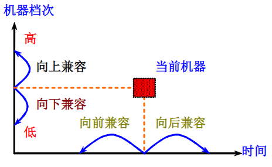
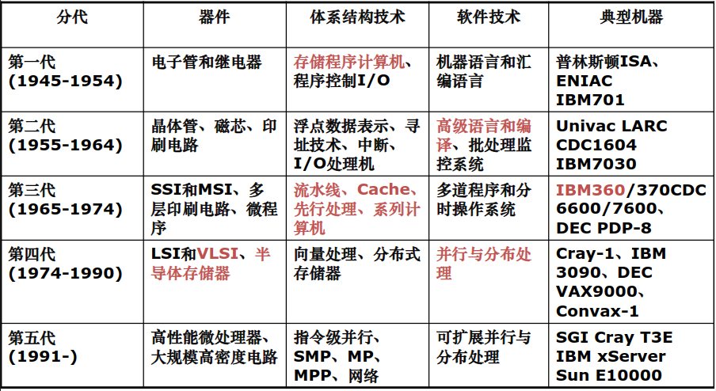
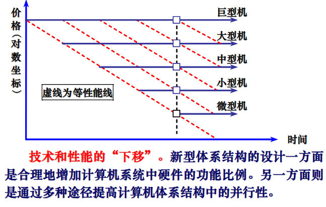

<!-- @import "[TOC]" {cmd="toc" depthFrom=1 depthTo=3 orderedList=false} -->
<!-- code_chunk_output -->

- [1.1 计算机体系结构的概念](#11-计算机体系结构的概念)
  - [1.1.1计算机体系结构概念的演变](#111计算机体系结构概念的演变)
  - [1.1.2 计算机体系结构, 组成和实现](#112-计算机体系结构-组成和实现)
  - [1.1.3 系列机和兼容](#113-系列机和兼容)
- [1.2 计算机体系结构的发展](#12-计算机体系结构的发展)
  - [1.2.1 计算机分代和分型](#121-计算机分代和分型)
  - [1.2.3 软件的发展](#123-软件的发展)
  - [1.2.3 应用的发展](#123-应用的发展)
  - [1.2.4 相关核心技术的发展](#124-相关核心技术的发展)
  - [1.2.5 体系结构的发展](#125-体系结构的发展)

<!-- /code_chunk_output -->

## 1.1 计算机体系结构的概念

### 1.1.1计算机体系结构概念的演变

#### 计算机组成

- 指令集结构的逻辑实现
  - 数据通路宽度
  - 专用功能部件的设置
  - 功能部件的并行性
  - 缓冲和排队技术
  - 预测技术
  - 可靠性技术
  - 控制机构的组成, 等等

#### 计算机的实现

- 处理器, 主存的物理结构
- 器件的集成度和速度
- 信号传输
- 器件, 模块, 插件, 底板的划分与连接
- 涉及的专用器件
- 电源, 冷却
- 微组装技术
- 整机装配技术, 等等

### 1.1.2 计算机体系结构, 组成和实现

- 体系结构的概念用于描述计算机系统设计的技术, 方法和理论, 包含以下三个方面:
  1. 计算机指令系统
  2. 计算机组成
  3. 计算机硬件实现
- 涵盖处理器和多处理器, 存储器, 输入/输出系统, 互联与通信等计算机系统设计的主要内容
- 还涉及到性能评价, 编译和操作系统技术
- 通过定量分析的途径, 学习掌握现代计算机体系结构研究的基本方法

### 1.1.3 系列机和兼容

#### 系列机

- 系列机 (family machine) 是具有相同体系结构, 但组成和实现不同的一系列不同型号的计算机系统
- 系列机就是指在一个厂家圣餐的具有相同的指令集结构, 但具有不同组成和实现的一系列不同型号的机器
- 现代计算机不但系统系列化, 其构成部件和软件也系列化
  - 如: CPU, 硬盘, 操作系统, 高级语言

#### 软甲兼容

- 系列机具有相同的体系结构, 软件可以在系列计算机的各档机器上运行
- 同一个软件可以不加修改地运行于体系结构相同的各档机器, 而且它们所获得的结果一样, 差别只有运行时间
- 兼容分为二进制级兼容, 汇编级兼容, 高级语言兼容, 数据级兼容等等

#### 兼容机

- 不同厂家生产的具有相同体系结构的计算机
- 推动了部件标准的规范化, 推进了计算机产品标准化的进程, 降低生产和制造成本
- 在市场上有较强的生产力

#### 兼容性

- 向上(下)兼容指的是按某档机器编制的程序, 不加修改的就能运行于比它高(低)档的机器
- 向前(后)兼容指的是按某个时期投入市场的某种型号机器编制的程序, 不加修改地就能运行与在它之前(后)投入市场的机器

#### 兼容对体系结构的影响

- 计算机系统及软件设计者的 "障碍"
  - 系统软件的开发难度大
  - 需要保护巨大的应用软件宝库
- 向后兼容是才是软件兼容的根本特征, 也是系列机的根本特征
  - 为了保证软件的兼容，要求指令集不改变, 这无疑又妨碍计算机体系结构的发展
  - 向后兼容虽然削弱了系列机对体系结构发展的约束, 但仍然是体系结发展的沉重包袱
  - 20世纪80年代具有 RISC 体系结构的微处理器在新结构, 新技术应用等方面领先传统的 CISC 微处理器的主要原因之一

## 1.2 计算机体系结构的发展

### 1.2.1 计算机分代和分型

### 1.2.3 软件的发展

程序和数据使用的存储器容量不断增大

1. 计算机语言与编译技术
2. 操作系统
3. 软件工具与中间件

### 1.2.3 应用的发展

- 嵌入式计算机, 包括移动设备和掌上计算机 (关注功耗, 成本等)
- 台式计算机, 对性价比要求最高
- 服务器市场, 可用性, 高流量密度和可拓展性
- 数据中心, 类似于服务器的要求, 电能和散热系统很重要
- 巨型机, 面向浮点运算的数据中心计算机, 内部网络需要更高的带宽和更低的延迟

### 1.2.4 相关核心技术的发展

1. 集成电路逻辑技术 摩尔定律
2. DRAM (动态随机访问存储器)
3. 闪存 (快擦型存储器)
4. 磁盘
5. 网络

### 1.2.5 体系结构的发展

1. 分布的 I/O 处理能力
2. 保护的存储器空间
3. 存储器组织结构的发展
4. 并行处理技术
5. 指令集发展
