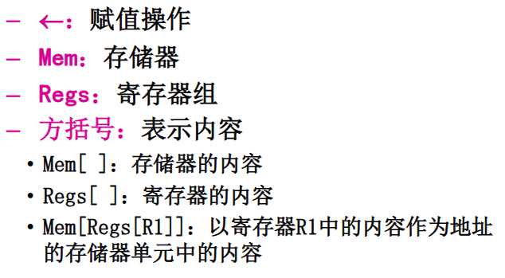

<!-- @import "[TOC]" {cmd="toc" depthFrom=1 depthTo=6 orderedList=false} -->
<!-- code_chunk_output -->

- [2.3 寻址方式](#23-寻址方式)
- [2.4 操作数类型和大小](#24-操作数类型和大小)
- [2.5 指令系统的设计和优化](#25-指令系统的设计和优化)
  - [2.5.1 指令系统设计的基本原则](#251-指令系统设计的基本原则)
  - [2.5.2 控制指令](#252-控制指令)
  - [2.5.3 指令操作码的优化](#253-指令操作码的优化)

<!-- /code_chunk_output -->

## 2.3 寻址方式

在通用寄存器型指令集结构中, 一般是利用寻址方式指明指令中的操作数是一个常数, 一个寄存器操作数, 或是一个存储器操作数.

寻址实际上是从形式地址到实际地址的转换. 形式地址由指令描述, 实际地址也称为有效地址.  
有效地址指明的是存储器单元的地址或寄存器地址.  
必须加速有效地址生成.

常用的一些操作数寻址方式:

两种表示寻址方式的方法:

- 将寻址方式编码于操作码中, 由操作码描述相应操作的寻址方式
- 在指令字中设置专门的寻址字段, 用以直接指出寻址方式

## 2.4 操作数类型和大小

1. 操作数类型
   - 操作数类型和操作数表示也是软硬件主要界面之一
   - 操作数类型是面向应用, 面向软件系统所处理的各种数据结构
   - 操作数表示是硬件结构哦能够识别, 指令系统可以直接调用的那些结构
   - 操作数表示所表征的那些操作数类型, 是应用软件和系统软件所处理的操作数类型的子集
   - 整数, 浮点, 字符和字符串
   - 操作数类型的表示主要有以下两种方法:
     - 由操作码的编码指定
     - 由硬件解释的标记
   - 大小: 字节, 半字, 单字, 双字 (64位)

## 2.5 指令系统的设计和优化

### 2.5.1 指令系统设计的基本原则

1. 指令系统的设计
   - 首先考虑所应实现的基本功能, 确定哪些基本功能应该由硬(软)件实现比较合适.
   - 包括:
     - 指令的功能设计
     - 指令格式的设计
2. 考虑 3 个因素: 成本, 速度, 灵活性
3. 基本要求: 完整性, 规整性, 正交性, 高效率, 兼容性

### 2.5.2 控制指令

程序中控制流程的改变情况包括:

- 跳转 (jump)
- 条件分支 (conditional branch)
- 过程调用 (call)
- 过程返回 (return)

过程调用和返回的状态保护

- 调用者保护
- 被调用者保护

### 2.5.3 指令操作码的优化

- 指令由两部分组成: 操作码, 地址码
- 指令格式的设计: 确定指令字的编码方式, 包括操作码字段和地址码字段的编码和表示方式
- 指令格式的优化: 如何用最短的位数来表示指令的操作信息和地址信息

1. 等长拓展码
2. 定长操作码
