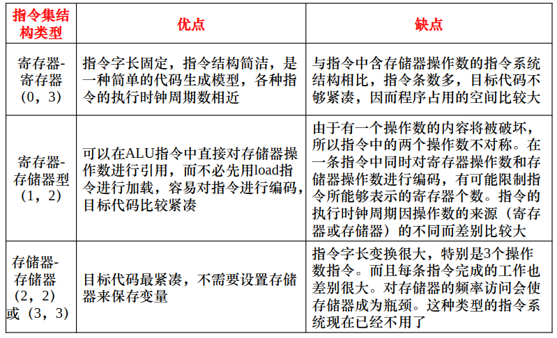

<!-- @import "[TOC]" {cmd="toc" depthFrom=1 depthTo=6 orderedList=false} -->
<!-- code_chunk_output -->

- [2.1 指令系统概述](#21-指令系统概述)
- [2.3 指令系统结构的分类](#23-指令系统结构的分类)

<!-- /code_chunk_output -->

## 2.1 指令系统概述

指令系统是计算机系统中软件与硬件交界的一个主要标志:
> 软件设计人员利用指令系统编制各种应用软件和系统软件;  
> 硬件设计人员采用各种手段实现指令系统

- 指令集
  - 一些指令的集合
  - 每条指令都是由 CPU 硬件执行
- 指令的表示方法:
  - 二进制格式
  - 物理存储空间组织方式有位, 字节, 字, 多字等
  - 当前的指令字长有: 16, 32, 64位
  - 可变长度格式和固定长度格式
- 指令的操作十分简单, 其操作由操作码编码表示
- 每个操作所需的操作数个数为 0-3 个不等
  - 操作数一些存储单元的地址
  - 典型的存储单元通常有: 主存, 寄存器, 堆栈和累加器
  - 操作数地址隐式表示或显式表示

## 2.3 指令系统结构的分类

一般来说, 从以下五个因素考虑来进行分类:

- 在 CPU 中操作数的存储方式
- 指令中显式表示的操作数个数
- 操作数的寻址方式
- 指令集所提供的操作类型
- 操作数的类型和大小

CPU 中用来存储操作数的存储单元主要有:

- 堆栈
- 累加器
- 一组寄存器

指令中的操作数可以被明确的显式给出, 也可以按照某种约定隐式给出

三类指令集结构:

- 堆栈型指令集结构
- 累加器型指令集结构
- 通用寄存器型指令集结构

通用寄存器型指令集结构的分类:

- 寄存器 - 寄存器型 (R-R: register-register)
- 寄存器 - 存储器型 (R-M: register-memory)
- 存储器 - 存储器型 (M-M: memory-memory)

三种通用寄存器型指令集结构的优缺点:

