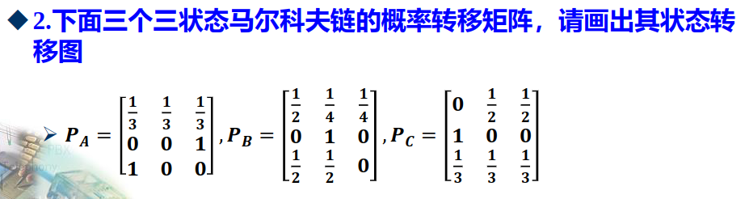
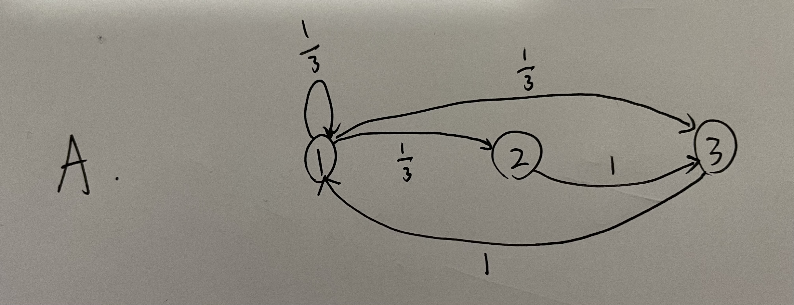
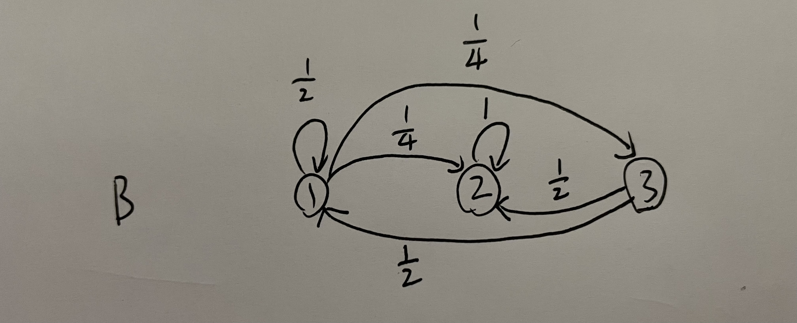
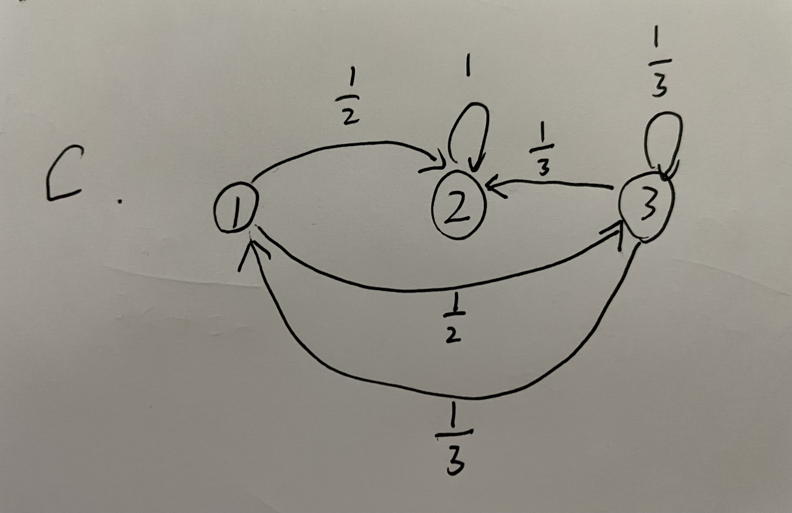
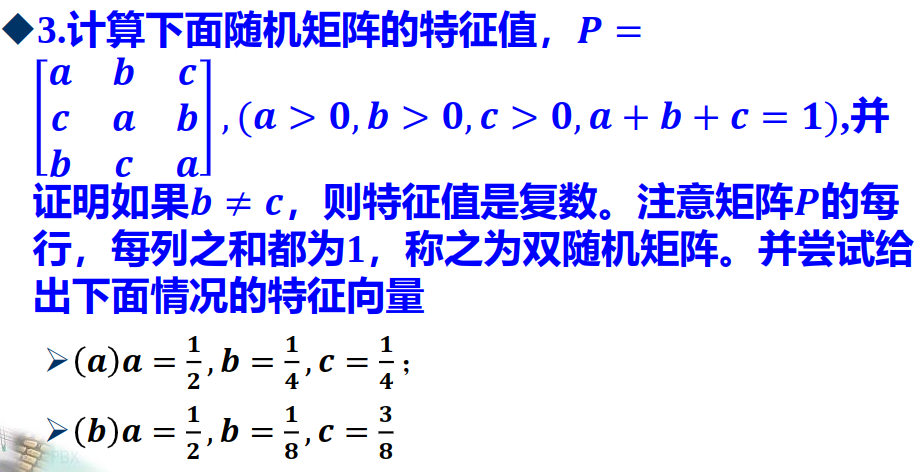
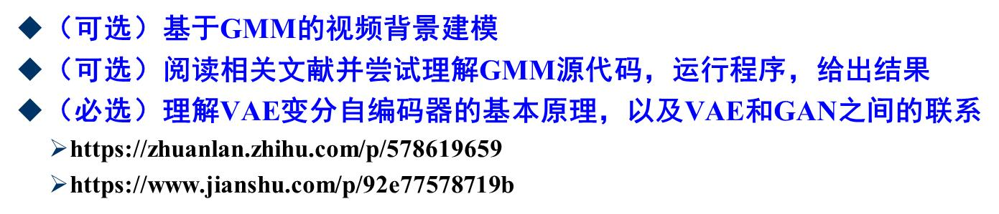
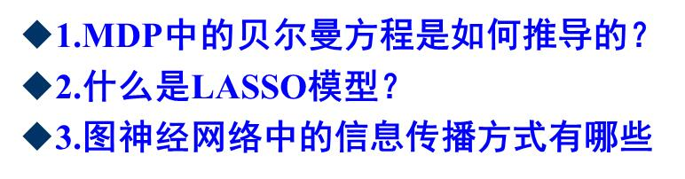

# 第二次作业

## 第 5 章 马尔科夫链

> 1.请梳理马尔科夫决策过程 (MDP) 的基本概念.

马尔科夫决策过程是一个 4 元组 $(S, A, P_a, R_a)$, 其中:

- $S$ 是状态空间的集合,
- $A$ 是动作的集合, 也被称为动作空间 (比如说 $A_S$ 是状态 $s$ 中可用的动作集合)
- $P_a(s, s') = \Pr (s_{t+1} = s' \mid s_t = s, a_t = a)$ 是 $t$ 时刻 $s$ 状态下的动作 $a$ 导致 $t+1$ 时刻状态从 $s$ 转移到 $s'$ 的概率
- $R_a(s, s')$ 是 $t$ 时刻 $s$ 状态下的动作 $a$ 导致 $t+1$ 时刻状态从 $s$ 转移到 $s'$ 的奖励 (或预期的奖励)

> 2.请梳理隐马尔科夫模型 (HMM) 的基本表达方式和核心问题.

隐马尔可夫模型 (Hidden Markov Model, HMM) 是一种统计模型，常用于对观测序列进行建模，特别是序列中的时间相关性较强的问题。它是一个关于随机过程的概率模型，可以用来描述由一个不可观测的隐含状态随机序列所产生的可观测的序列，即每个时刻观测到的数据依赖于一个相应的隐藏状态。

HMM 的基本表达方式通常包括以下组成部分：

1. 隐藏状态集合 (State Space) ：一个有限的隐藏状态集合，表示系统可能处于的各种状态。
2. 观测集合 (Observation Space) ：每个隐藏状态生成的观测的集合。
3. 初始概率分布 (Initial Probability Distribution) ：描述初始时刻各隐藏状态的概率分布。
4. 状态转移概率矩阵 (Transition Probability Matrix) ：描述隐藏状态之间的转移概率。
5. 观测概率分布 (Observation Probability Distribution) ：描述在每个隐藏状态下生成各种观测的概率分布。

HMM 的核心问题包括：

1. 评估问题 (Evaluation Problem) ：给定模型参数和观测序列，计算给定观测序列的概率。
2. 解码问题 (Decoding Problem)：给定模型参数和观测序列，找到最可能产生观测序列的隐藏状态序列。
3. 学习问题 (Learning Problem)：基于观测序列，估计模型参数，包括初始概率分布、状态转移概率矩阵和观测概率分布。

## 第 6 章 生灭过程和泊松过程

> 1.若 $p_{ij} = \frac{i+j}{6+3j}, i, j = 1, 2, 3$  
> (a) 证明概率转移矩阵 $P$ 是行随机矩阵;  
> (b) 在状态 $S_2, S_3$ 之间的状态转移概率是多少?  
> (c) 如果马尔科夫链中的初始概率分布 $P^{(0)} = [\frac{1}{2} \frac{1}{4} \frac{1}{4}]$, 则一步之后占据状态 $S_1, S_2, S_3$ 的概率分别是多少? 并解释为何该链在状态 $S_2$ 的概率是 $\frac{1}{3}$ 并与步数无关.

解答:

(a) 由于 $p_{ij} \geq 0$ 且 $\sum_{i=1}^3 p_{ij} = 1$, 所以 $P$ 是列随机矩阵.  
(b) $p_{23} = \frac{2+3}{6+3\times 3} = \frac{5}{15} = \frac{1}{3}$, $p_{32} = \frac{3+2}{6+3\times 2} = \frac{5}{12}$.  
(c) $P^{(1)} = P^{(0)} P = \begin{bmatrix} \frac{2}{9} & \frac{3}{12} & \frac{4}{15} \\ \frac{3}{9} & \frac{4}{12} & \frac{5}{15} \\ \frac{4}{9} & \frac{5}{12} & \frac{6}{15} \end{bmatrix} [\frac{1}{2} \frac{1}{4} \frac{1}{4}]^T = [\frac{173}{720} \frac{1}{3} \frac{307}{720}]$. 因为 $p_{21} = p_{22} = p_{23} = \frac{1}{3}$, 所以该链在状态 $S_2$ 的概率是 $\frac{1}{3}$ 并与步数无关.

> 

解答:

> 

解答:

不难得到, 特征方程是 $(\lambda - a)^3 - (\lambda - a) * 3bc - b^3 - c^3 = 0$

得到 $\lambda^3 - 3a\lambda^2 + 3(a^2-bc)\lambda + 3abc - a^3 -b^3 - c^3 =0$

判别式:
$$\begin{equation*}
    \begin{aligned}
        \Delta =& \left( \frac{-(-3a)^3}{27} - \frac{3abc - a^3 - b^3 - c^3}{2} + \frac{-3a(3(a^2-bc))}{6} \right)^2 + \left( \frac{3(a^2-bc)}{3} - \frac{(-3a)^2}{9} \right)^3 \\
        =& \left( \frac{27a^3}{27} - \frac{3abc - a^3 - b^3 - c^3}{2} - \frac{9a^3 - 9abc}{6} \right)^2 + \left( \frac{3(a^2-bc)}{3} - \frac{9a^2}{9} \right)^3 \\
        =& \left( \frac{b^3 + c^3}{2} \right)^2 + \left( -bc \right)^3 \\
        =& \frac{b^6 + c^6 - 2b^3c^3}{4} \\
        =& \left( \frac{b^3-c^3}{2} \right)^2 \geq 0
    \end{aligned}
\end{equation*}$$
当且仅当, $b = c$时, 判别式为 0, 此时有三个实根; 否则, 判别式大于 0, 此时有一个实根和一对共轭复根.

(a) $a=\frac{1}{2}, b=\frac{1}{4}, c=\frac{1}{4}$
得到方程为:
$\lambda^3 - \frac{3}{2}\lambda^2 + \frac{9}{16}\lambda - \frac{1}{16} = 0$

解得: $\lambda_1 = 1, \lambda_2 = \lambda_3 = \frac{1}{4}$

$\lambda_1$ 对应的特征向量为: $k\cdot[1, 1, 1]^T$, $\lambda_2, \lambda_3$ 对应的特征向量为: $k_1\cdot[1, -1, 0]^T + k_2\cdot[1,0,-1]^T$

(b) $a=\frac{1}{2}, b=\frac{1}{8}, c=\frac{3}{8}$
得到方程为:
$\lambda^3 - \frac{3}{2}\lambda^2 + \frac{39}{64}\lambda - \frac{7}{64} = 0$

解得: $\lambda_1 = 1, \lambda_2 = \frac{2 + \sqrt{3}i}{8}, \lambda_3 = \frac{2 - \sqrt{3}i}{8}$

$\lambda_1$ 对应的特征向量为: $k\cdot[1, 1, 1]^T$.

## 第 7 章

> 

VAE 变分自编码器的基本原理:

3.解答:

VAE 的第一个组件是编码器，通常由神经网络架构（例如前馈卷积网络）构建，负责学习和编码输入的表示并将其驱动到潜在空间。此外，生成的潜在空间通常是高斯分布的混合。

VAE 的第二个组件是解码器，也是由卷积神经网络构成。一旦编码器形成潜在空间，解码器的工作就是转换潜在空间以返回原始输入。因此，它的目的是通过最大化新创建的图像相对于输入数据的可能性来生成尽可能代表输入的输出。

VAE 的损失函数: $loss=MSE(X,X')+KL(N(\mu_1,\sigma_1^2),N(0,1))$

VAE 和 GAN 的设计和使用基本上都是为了图像生成.
VAE 和 GAN 之间的主要区别之一在于它们的训练方法，因为 VAE 的训练遵循无监督方法，而 GAN 则遵循监督技术。

## 第 9 章

> 

1.解答:

离散型:
$V_n(i) = \underset{a}{\max}[R(i, a) + \sum_j P_{i, j}(a)\cdot B_{n-1}(j)]$

连续型:
$V_n(i) = \underset{a}{\max}[R(i, a) + \int_{-\infty}^{+\infty} P_{i, j}(a)\cdot B_{n-1}(j) \mathrm{d}j]$

2.解答:

LASSO（Least Absolute Shrinkage and Selection Operator）是一种常用的线性回归和机器学习技术，用于估计具有稀疏性结构的回归模型参数。与传统的最小二乘法相比，LASSO 增加了一个正则化项，该项是参数向量的 L1 范数。这使得 LASSO 能够产生稀疏解，即使得许多参数值为零，从而具有特征选择的能力。

LASSO 模型的优化目标是通过最小化损失函数来找到最佳的模型参数。其优化问题可以形式化为：

\[ \min_{\beta} \left\{ \frac{1}{2n} \sum_{i=1}^{n}(y_i - x_i^T\beta)^2 + \lambda \|\beta\|_1 \right\} \]

其中，\(n\) 是观测样本的数量，\(y_i\) 是观测数据的输出，\(x_i\) 是对应的特征向量，\(\beta\) 是模型参数，\(\lambda\) 是正则化参数。L1 范数项 \(\|\beta\|_1\) 用来约束模型参数的绝对值之和。通过调节参数 \(\lambda\) 的大小，可以控制稀疏性和模型的复杂度。

LASSO 模型的特点包括：

1. 可以用于特征选择，即自动地将某些特征的系数收缩为零，从而剔除不相关的特征。
2. 适用于高维数据集，可以处理特征数量远大于样本数量的情况。
3. 通过调节正则化参数 \(\lambda\)，可以控制模型的复杂度和稀疏性。

3.解答:

常见的图神经网络传播方式包括：

1. 图卷积网络（Graph Convolutional Networks，GCNs）：GCN 是最常见的图神经网络结构之一，其信息传播方式类似于卷积神经网络中的卷积操作。GCN 中的信息传播依赖于节点之间的连接关系，并利用节点及其邻居节点的特征进行信息传递和聚合。
2. 图注意力网络（Graph Attention Networks，GATs）：GAT 是一种允许学习节点之间关系的图神经网络，其信息传播方式基于注意力机制。GAT 能够为不同节点之间的连接分配不同的权重，从而使得每个节点能够聚合其邻居节点的信息时更加灵活和精准。
3. 图神经网络消息传递（Graph Neural Network Message Passing，GNNMP）：GNNMP 是一类基于消息传递的图神经网络模型。它通过定义节点之间的消息传递规则来实现信息的传播和聚合。常见的 GNNMP 包括 GraphSAGE、Gated Graph Neural Networks（GGNNs）等。
4. 图自注意力网络（Graph Self-Attention Networks）：这类网络结构利用了自注意力机制来计算节点之间的关系。通过引入自注意力机制，网络可以根据节点特征之间的相似度动态地计算每个节点对其邻居节点的注意力权重。
