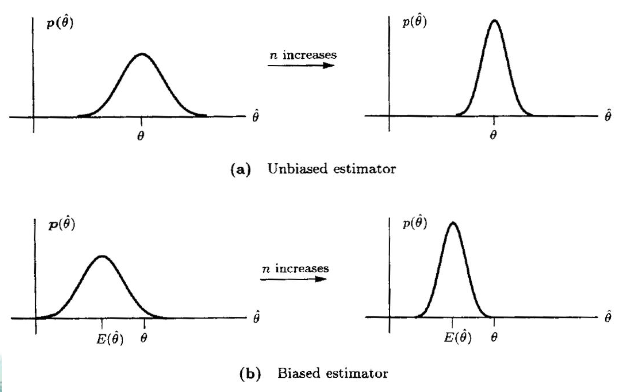

# 第二章 随机模拟参数估计

## 2.0 计算机模拟

> - 图像和信号处理都涉及随机变量的变换
> - 关键: 模拟经验分布的数据能很好地拟合感兴趣随机变量的理论分布
> - 逆换算法

## 2.0 引言

> 参数估计
> > 基本概念: 我们通过概率分布来建模随机变量, 还需要进一步来确定分布的参数, 从而能够是的概率反映随机变量所描述的分布  
> > 参数估计分为点估计和区间估计
>
> 无偏估计
> > $E[\hat{\theta}] = \theta$, $\color{red}{无偏性}$
> 渐进无偏
> > $\text{{lim}}_{n \rightarrow \infty}E[\hat{\theta}] \rightarrow \theta$
>
> 无偏性表明平均来说, 估计子给出了期望的参数值, 但如果估计子的方差过大, 则也没有适用价值! $\color{red}{有效性!}$
>
> 无偏性与 Chebyshev 不等式
>
> 区间估计之置信区间
> > 置信区间的求解  
> > 置信度与置信区间以及样本量的关系

## 2.1 最小方差无偏估计 Minimum Variance Unbiased Estimator(MVUE)

### 无偏估计

Example 2.1:  
考虑以下观察值:
$$ x[n] = A + w[n] \quad n=0,1,\dots,N-1 $$
其中, $A$是要估计的参数, $w[n]$是白噪声 (white gaussian noise).
参数 $A$ 的取值范围可以是$-\infty < A < +\infty$.
$x[n]$平均值的合理估计子为
$$\begin{equation} \hat{A} = \frac{1}{N} \sum_{n=0}^{N-1}x[n] \end{equation}$$
对任意$A$, 由期望算子的线性属性可知
$$\begin{equation}
\begin{split}
    E(\hat{A}) = & E\left[\frac{1}{N}\sum_{n=0}^{N-1}x[n] \right] \\
    = & \frac{1}{N}\sum_{n=0}^{N-1}E(x[n]) \\
    = & \frac{1}{N}\sum_{n=0}^{N-1}A \\
    = & A
\end{split}
\end{equation}$$
样本的平均是无偏估计

Example 2.2:  
考虑
$$ \hat{A} = \frac{1}{2N}\sum_{n=0}^{N-1}x[n] $$
Then
$$\begin{equation}
    \begin{split}
        E(\hat{A})&=\frac{1}{2}A \\
        &= A, \quad if A = 0 \\
        &\neq A, \quad if A \neq 0 \\
    \end{split}
\end{equation}$$

一个无偏估计并不意味着这是一个好估计.
这只保证了平均值可能会达到参数的真实值.
而持续的偏差总是会导致错误的估计.  
例如, 无偏属性在以下情况下具有重要含义: 几个估计量被组合起来.
合理的程序是结合通过对这些估计进行平均以形成更好的估计.

假设估计值是无偏的, 具有相同的方差, 彼此不相关:
$$ E(\hat{\theta})=\theta $$
以及
$$\begin{equation}
    \begin{split}
        \text{var}(\hat{\theta}) =& \frac{1}{n^2}\sum_{i=1}^{n}\text{var}(\hat{\theta_i}) \\
        =& \frac{\text{var}(\hat{\theta_1})}{n}
    \end{split}
\end{equation}$$
因此, 对越多估计值进行平均, 方差将会减小

考虑有偏差的情况, 假设估计值存在偏差$E(\hat{\theta_i}) = \theta + b(\theta)$, 那么有
$$\begin{equation}
    \begin{split}
        E(\hat{\theta}) =& \frac{1}{n}\sum_{i=1}^{n}E(\hat{\theta_i}) \\
        =& \theta + b(\theta)
    \end{split}
\end{equation}$$
然后, 无论对多少估计值进行平均, $\hat{\theta}$都不会逼近真实值.  
那么, 定义
$$ b(\theta) = E(\hat{\theta}) - \theta $$
为估计值的偏差

上图是随着 $n$ 的增加, $n$ 对估计值(无偏和有偏)的影响.

### Minimun Variance Criterion (最小方差准则, MVC)

为了找到最优估计量, 我们需要采用一些最优性标准.
一个自然的误差是均方误差 (mean square error, MSE), 定义为:
$$\text{mse}(\hat{\theta})=E\left[{(\hat{\theta} - \theta)}^2\right]$$
不幸的是, 采用这种自然标准会导致无法实现估计器, 不能仅作为数据函数编写的估计器.

为了理解这个问题, 我们首先重写 MSE 为:
$$ \begin{equation}
    \begin{split}
        \text{mse}(\hat{\theta})\quad =&\quad E\left\{\left[\left(\hat{\theta} - E(\hat{\theta})\right) + \left(E(\hat{\theta} - \theta)\right)\right]^2\right\} \\
        =& \quad \text{var}(\hat{\theta}) + \left[E(\hat{\theta} - \theta)\right]^2 \\
        =& \quad \text{var}(\hat{\theta}) + b^2(\theta)
    \end{split}
\end{equation} $$

## 2.5 最大后验估计 MAP

### Maximum A-Posteriori Esitmator (MAP)

假设$\theta$是随机变量, 有分布函数$p(\theta)$  
考虑$p(\theta/D) = \frac{p(D/\theta)p(\theta)}{p(D)}$  
若要使得 $p(\theta/D)$ 最大, 则考虑使得 $p(D/\theta)p(\theta)$ 最大, 即 $\prod_{k=1}^{n}p(x_k/\theta)p(\theta)$ 最大.
或使得 $\sum_{k=1}^{n}\ln p(x_k/\theta)+\ln p(\theta)$ 最大.

假设 $p(\theta)$ 是均匀分布, 会发生什么呢?
$$ \sum_{k=1}^{n}\ln p(x_k/\theta)+\ln p(\theta) \rightarrow \sum_{k=1}^{n} \ln p(x_k/\theta) $$
即 MAP 等同于 MLE

### MAP 估计多变量高斯分布

未知参数 $\theta = \mu$  
假设 $p(x/\mu) \sim N(\mu, \Sigma = Diag(\sigma_\mu))$  
以及 $p(\mu) \sim N(\mu_0, \Sigma_\mu = Diag(\sigma_{\mu_0}))$  
$\mu_0$ 和 $\sigma_{\mu_0}$ 都未知  
若使得 $\ln p(\mu/D) = \ln p(D/\mu)p(\mu)$ 最大:
$$ \begin{equation*}
    \begin{aligned}
        \sum_{k=1}^{n}\ln p(x_k/\mu)+\ln p(\mu) \\
        \nabla_\mu(\sum_{k=1}^{n}\ln p(x_k/\mu)+\ln p(\mu)) = 0
    \end{aligned}
\end{equation*} $$
即
$$\begin{equation*}
        \sum_{k=1}^{n}\frac{1}{\sigma_\mu^2}(X_k-\mu)-\frac{1}{\sigma_{\mu_0}^2}(\mu-\mu_0)=0 \quad \text{or} \quad \hat{\mu}=\frac{\mu_0+\frac{\sigma_{\mu_0}^2}{\sigma_\mu^2}\sum_{k=1}^{n}X_k}{1+\frac{\sigma_{\mu_0}^2}{\sigma_\mu^2}n}
\end{equation*}$$

- 如果 $\frac{\sigma_{\mu_0}^2}{\sigma_\mu^2} \gg 1$, 那么 $\hat{\mu} = \frac{1}{n}\sum_{k=1}^{n}X_k $
- 如果 $\sigma_{\mu_0} \rightarrow 0$, 那么 $\hat{\mu} = \mu_0$

### 有偏估计与无偏估计

一个估计 $\hat{\theta}$ 是无偏估计, 当 $E[\hat{\theta}] = \theta$  
ML 估计 $\hat{\mu}$ 是无偏的, 例如: $E[\hat{\mu}] = \mu$  
ML 估计 $\hat{\sigma}$ 和 $\hat{\Sigma}$ 是有偏的: $E[\hat{\sigma}^2] = \frac{n-1}{n}\sigma^2$, $E[\hat{\Sigma}] = \frac{n-1}{n}\Sigma$  
以下是 $\hat{\sigma}$ 和 $\hat{\Sigma}$ 的无偏估计:
$$\begin{equation*}
    \begin{aligned}
        \hat{\sigma} = \frac{1}{n-1}\sum_{k=1}^{n}(X_k - \hat{\mu})^2 \\
        \hat{\Sigma} = \frac{1}{n-1}\sum_{k=1}^{n}(X_k-\hat{\mu})(X_k-\hat{\mu})^{t}
    \end{aligned}
\end{equation*}$$

## 2.6 期望最大化方法 Expectation-Maximiazation (EM)

### Description

- EM 是一种迭代的 ML 估计方法
- 从 $\theta$ 的一个初始估计开始
- 迭代地对当前估计进行细化, 以增加观测数据的可行性: $p(D/\theta)$
- EM代表一个通用框架, 在数据不完整的情况下效果最好 (或可以认为是不完整的情况下).
- 需要一个创造力来识别可以使用 EM 算法的场景.
- 估计高斯混合模型 (Mixtures of Gaussians, MoG) 的标准方法.

> [EM from wikipedia](https://en.wikipedia.org/wiki/Expectation%E2%80%93maximization_algorithm)

Given the statistical which generates a set $X$ of observed data, a set of unobserved latent data or missing values $Z$, and a vector of unknown paramteters $\theta$, along with a likelihood function $L(\theta; X, Z) = p(X, Z | \theta)$, the maximum likelihood estimate (MLE) of the unknown parameters is determined by the marginal likeihood of the observed data.
$$ L(\theta; X) = p(X|\theta) = \int p(X, Z|\theta)dZ = \int p(X|Z, \theta)p(Z|\theta)dZ $$
However, this quantity is often intractable (e.g. if $Z$ is a sequence of events, so that the number of values grows exponentially with the sequence length, making the exact calculation of the sum extremely difficult).

The EM algorithm seeks to find the MLE of the marginal likelihood by iteratively applying these two steps:

<dd>
Expectation step (E step): Calculate the expected value of the log likelihood function, with respect to the conditional distribution of $Z$ given $X$ under the current estimate of the parameters $\theta^{(t)}$
$$ Q(\theta|\theta^{(t)}) = E_{Z\sim p(\cdot|X, \theta^{(t)})}[\log p(X, Z|\theta)] $$
</dd>

<dd>
Maximization step (M step): Find the parameters that maximize this quantity:
$$ \theta^{(t+1)} = \underset{\theta}{\operatorname{arg\,max}}\ Q({\boldsymbol{\theta }}\mid {\boldsymbol{\theta}}^{(t)}) $$
</dd>

The typical models to which EM is applied use $Z$ as a latent variable indicating membership in one of a set of groups:

1. The observed data points $X$ may be discrete (taking values in a finite or countably infinite set) or continuous (taking values in an uncountably infinite set). Associated with each data point maybe a vector of observations.
2. The missing values (aka latent variables) $Z$ are discrete, drawn from a fixed number of values, and with one latent variable per observed unit.
3. The parameters are continuous, and are of two kinds: Parameters that are associated with all data points, and those associated with a specific value of a latent variable. (i.e., associated with all data points which corresponding latent variable has that value).

### Incomplete Data

- 很多时候, 由于某些特征无法直接测量, 所以无法应用 ML 估计的方法.
- EM 算法非常适用于存在未观察到的 (缺失) 数据的问题.

### EM: Main Idea

假设只有 $y$, 那么通过以下方法去估计 $\theta$:

> 对于给定的 $D_y$ 和一个 $\theta$ 的估计, 最大化 $\ln p(D_x/\theta)$ 的期望 (相对于未知变量)

$$ Q(\theta;\theta^t) = E_{x_{\text{unobserved}}}(\ln p(D_x/\theta)/D_y, \theta^t) $$

### EM Steps

1. Initialization
2. E-Step: Expectation
3. M-Step: Maximization
4. Test for convergence

### EM Steps (cont'd)

1. Initialization Step: initialize the algorithm with a guess $\theta^0$
2. Expectation Step: it is performed with respect to the unobserved variavles, using the current estimate of parameters and conditioned upon the observations:
    $$ Q(\theta; \theta^t) = E_{x_\text{unobserved}}(\ln p(D_x/\theta)/D_y, \theta^t) $$
    -Note: if $\ln p(D_x \mid \theta) $ is a linear function of the unpbserved variables, the expectation step is equivalent to:
    $$ Q(\theta; \theta^t) = E(x_{\text{unobserved}}/D_y, \theta^t) $$
3. Maximization Step: provides a new estimate of the parameters:
    $$ \theta^{t+1} = \underset{\theta}{\operatorname{arg\,max}}\ Q(\theta; \theta^t) $$
4. Test for Convergence:
    $$ if |\theta^{t+1} - \theta^t | \lt \varepsilon $$
    stop; otherwise, go to Step 2.
