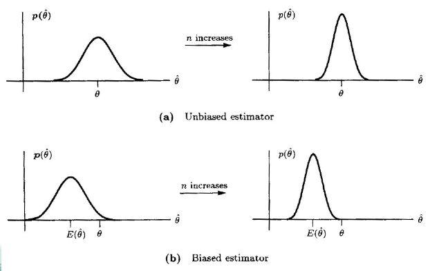

## 2.0 计算机模拟

> - 图像和信号处理都涉及随机变量的变换
> - 关键: 模拟经验分布的数据能很好地拟合感兴趣随机变量的理论分布
> - 逆换算法

## 2.0 引言

> 参数估计
> > 基本概念: 我们通过概率分布来建模随机变量, 还需要进一步来确定分布的参数, 从而能够是的概率反映随机变量所描述的分布  
> > 参数估计分为点估计和区间估计
>
> 无偏估计
> > $E[\hat{\theta}] = \theta$, $\color{red}{无偏性}$
> 渐进无偏
> > $\text{{lim}}_{n \rightarrow \infty}E[\hat{\theta}] \rightarrow \theta$
>
> 无偏性表明平均来说, 估计子给出了期望的参数值, 但如果估计子的方差过大, 则也没有适用价值! $\color{red}{有效性!}$
>
> 无偏性与 Chebyshev 不等式
>
> 区间估计之置信区间
> > 置信区间的求解  
> > 置信度与置信区间以及样本量的关系

## 2.1 最小方差无偏估计 Minimum Variance Unbiased Estimator(MVUE)

### 无偏估计

Example 2.1:  
考虑以下观察值:
$$ x[n] = A + w[n] \quad n=0,1,\dots,N-1 $$
其中, $A$是要估计的参数, $w[n]$是白噪声 (white gaussian noise).
参数 $A$ 的取值范围可以是$-\infty < A < +\infty$.
$x[n]$平均值的合理估计子为
$$\begin{equation} \hat{A} = \frac{1}{N} \sum_{n=0}^{N-1}x[n] \end{equation}$$
对任意$A$, 由期望算子的线性属性可知
$$\begin{equation}
\begin{split}
    E(\hat{A}) = & E\left[\frac{1}{N}\sum_{n=0}^{N-1}x[n] \right] \\
    = & \frac{1}{N}\sum_{n=0}^{N-1}E(x[n]) \\
    = & \frac{1}{N}\sum_{n=0}^{N-1}A \\
    = & A
\end{split}
\end{equation}$$
样本的平均是无偏估计

Example 2.2:  
考虑
$$ \hat{A} = \frac{1}{2N}\sum_{n=0}^{N-1}x[n] $$
Then
$$\begin{equation}
    \begin{split}
        E(\hat{A})&=\frac{1}{2}A \\
        &= A, \quad if A = 0 \\
        &\neq A, \quad if A \neq 0 \\
    \end{split}
\end{equation}$$

一个无偏估计并不意味着这是一个好估计.
这只保证了平均值可能会达到参数的真实值.
而持续的偏差总是会导致错误的估计.  
例如, 无偏属性在以下情况下具有重要含义: 几个估计量被组合起来.
合理的程序是结合通过对这些估计进行平均以形成更好的估计.

假设估计值是无偏的, 具有相同的方差, 彼此不相关:
$$ E(\hat{\theta})=\theta $$
以及
$$\begin{equation}
    \begin{split}
        \text{var}(\hat{\theta}) =& \frac{1}{n^2}\sum_{i=1}^{n}\text{var}(\hat{\theta_i}) \\
        =& \frac{\text{var}(\hat{\theta_1})}{n}
    \end{split}
\end{equation}$$
因此, 对越多估计值进行平均, 方差将会减小

考虑有偏差的情况, 假设估计值存在偏差$E(\hat{\theta_i}) = \theta + b(\theta)$, 那么有
$$\begin{equation}
    \begin{split}
        E(\hat{\theta}) =& \frac{1}{n}\sum_{i=1}^{n}E(\hat{\theta_i}) \\
        =& \theta + b(\theta)
    \end{split}
\end{equation}$$
然后, 无论对多少估计值进行平均, $\hat{\theta}$都不会逼近真实值.  
那么, 定义
$$ b(\theta) = E(\hat{\theta}) - \theta $$
为估计值的偏差

上图是随着n的增加, n对估计值(无偏和有偏)的影响.

### Minimun Variance Criterion (最小方差准则, MVC)

为了找到最优估计量, 我们需要采用一些最优性标准.
一个自然的误差是均方误差 (mean square error, MSE), 定义为:
$$\text{mse}(\hat{\theta})=E\left[{(\hat{\theta} - \theta)}^2\right]$$
不幸的是, 采用这种自然标准会导致无法实现估计器, 不能仅作为数据函数编写的估计器.

为了理解这个问题, 我们首先重写 MSE 为:
$$ \begin{equation}
    \begin{split}
        \text{mse}(\hat{\theta})\quad =&\quad E\left\{\left[\left(\hat{\theta} - E(\hat{\theta})\right) + \left(E(\hat{\theta} - \theta)\right)\right]^2\right\} \\
        =& \quad \text{var}(\hat{\theta}) + \left[E(\hat{\theta} - \theta)\right]^2 \\
        =& \quad \text{var}(\hat{\theta}) + b^2(\theta)
    \end{split}
\end{equation} $$
