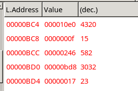
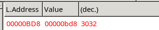
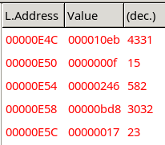

# 操作系统实验一报告

013-涂靖昊

> 1.请简述 `head.s` 的工作原理.

`head.s` 包含在 32 位保护模式下初始化设置的代码, 包括初始化 GDT, IDT, 所有段寄存器, 栈段, 设置 8253 定时芯片, 设置中断门和陷阱门, 以及中断处理程序; 初始化结束后, 手动建立从中断返回到任务 0 的场景, 然后执行中断返回指令, 切换到任务 0 中执行; 随后正常运行任务 0, 直到触发定时中断, 切换到任务 1 中执行; 执行任务 1 直到触发定时中断, 切换回任务 0, 重复上述过程.

> 2.请记录 `head.s` 的内存分布状况, 写明每个数据段, 代码段, 栈段的起始与终止的内存地址.

`head.s` 的内核代码会被先前执行的 `boot.s` 放到内存开头 `0x0000` 处开始执行,
所以执行 `break 0x0000`, 并运行 `continue` 后,
就可以看到 `head.s` 的内核代码在内存中的分布情况.
然后对照 `head.s` 的内核代码, 可以得到以下内存分布状况:

Tips:

1. 代码段对照 `head.s` 和 Bochs 中的指令运行窗口, 就非常容找到.
2. 数据段, 栈段和代码段在内存中的顺序与在 `head.s` 中是一致的. 所以也很容易分辨.
3. 分辨数据段的时候, 可以看到 `.long`, `.word` 等, 它们分别表示 4 字节 和 2 字节.
注意到这个的话, 也非常容易在内存中找到各数据段的部分.
4. 栈段通常对应 `head.s` 中的 `.fill 128, 4, 0` 等, 这个表示以 4 字节为单位, 取 128 单位的空间, 填充为 0.
这样内存中的栈段也非常容易找到.

| 代码段 | 起始地址 | 终止地址 |
|---|---|---|
| startup_32 | 0x0000 | 0x00ac |
| setup_gdt | 0x00ad | 0x00b4 |
| setup_idt | 0x00ad | 0x00c7 |
| rp_sidt | 0x00cd | 0x00e4 |
| write_char | 0x00e5 | 0x0113 |
| ignore_int | 0x0114 | 0x0129 |
| timer_interrupt | 0x012a | 0x0165 |
| system_interrupt | 0x0166 | 0x017c |
| task0 | 0x10e0 | 0x10f3 |
| task1 | 0x10f4 | 0x1107 |

| 数据段 | 起始地址 | 终止地址 |
|---|---|---|
| current | 0x017d | 0x0180 |
| scr_loc | 0x0181 | 0x0184 |
| lidt_opcode | 0x0186 | 0x018b |
| lgdt_opcode | 0x018c | 0x018b |
| idt | 0x0198 | 0x0997 |
| gdt | 0x0998 | 0x09d7 |
| ldt0 | 0x0be0 | 0x0bf7 |
| tss0 | 0x0bf8 | 0x0c5f |
| ldt1 | 0x0c60 | 0x0e77 |
| tss1 | 0x0e78 | 0x0edf |

| 栈段 | 起始地址 | 终止地址 |
|---|---|---|
| init_stack | 0x09d8 | 0x0bd7 |
| krn_stk0 | 0x0c60 | 0x0e5f |
| krn_stk1 | 0x0ee0 | 0x10df |
| user_stk1 | 0x1108 | 0x1307

> 3.简述 `head.s` `57` 至 `62` 行在做什么?

手动模拟 "正在执行某任务的过程中, 发生了中断, 在执行完中断处理程序后, 准备返回执行任务 0" 场景.
在这里, 代码将应该有的信息入栈, 然后调用中断返回指令,
这样的话就从特权级为 0 的初始化代码切换到了特权级为 3 的任务 0.

> 4.简述 `iret` 执行后, `pc` 如何找到下一条指令?

这是执行 `iret` 指令前栈的状态. 可以看到在当前栈顶的值是 task1 代码段的起始地址.
执行 `iret` 指令时, 会进行如下步骤:

1. 从栈中取出代码段选择子, 也就是我们看到的 `000010e0`, 并加载到 `eip` 寄存器中.
2. 取出指令指针值, 并加载到 `cs` 寄存器中.
3. 恢复其他状态, 如标志寄存器, 栈指针和任务的局部空间数据段 (堆栈段) 选择符.
4. 使用新的 `cs` 和 `eip` 跳转到执行下一条指令, 即任务 0 的代码.

> 5.记录 `iret` 执行前后, 栈是如何变化的?

执行 `iret` 指令前的栈的状态我们已经在上一个问题中看到.

下图是执行 `iret` 指令后的栈的状态.

可以清楚地看到此时栈指针指向栈底, 说明栈被清空.

> 6.当任务进行系统调用时, 即 `int 0x80` 时, 记录栈的变化情况.

执行 `int 0x80` 前栈的状态在上一个问题中已经给出, 栈处于空栈的状态.

执行 `int 0x80` 后, 栈切换到 krn_stk0, 状态如下:

可以看到栈的变化与我们先前讨论的 `head.s` 的 `57` 到 `62` 行的行为相同.  
依次将

1. 任务的当前局部空间数据段 (堆栈段) 选择符,
2. 堆栈指针,
3. 标志寄存器值,
4. 当前局部空间代码段选择符,
5. 原本 `int 0x80` 的下一条指令地址

入栈.
