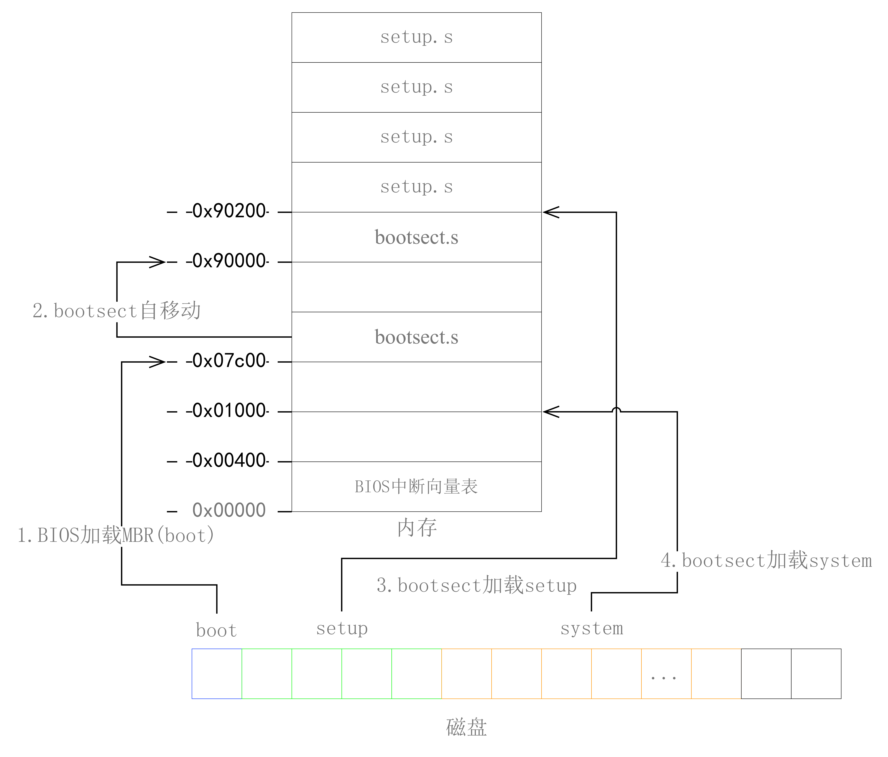

# 操作系统-实验三报告

作者: 013-涂靖昊

总效果如图所示:


## 1 改写`bootsect.s`

### 1.1 显示信息

在屏幕上打印一段提示信息. 如下图所示


实现这样的效果, 我们可以在 `boot.s` 中添加如下代码用于打印字符串:

```x86
# Print some inane message

    mov $0x03,  %ah     # read cursor pos
    xor %bh,    %bh
    int $0x10

    mov $25,    %cx
    mov $0x0007, %bx    # page 0, attribute 7 (normal)
    mov $msg1, %bp
    mov $0x1301, %ax    # write string, move cursor
    int $0x10

msg1:
    .byte 13,10
    .ascii "Tunix is booting..."
    .byte 13,10,13,10
```

### 1.2 加载 `setup`

以下代码用于加载 `setup` 到内存中:

```x86
load_setup:
    mov     $0x0000, %dx    # drive 0, head 0
    mov     $0x0002, %cx    # sector 2, track 0
    mov     $0x0200, %bx    # address = 512, in INITSEG
    .equ    AX, 0x0200+SETUPLEN
    mov     $AX, %ax        # service 2, nr of sectors
    int     $0x13           # read it
    jnc     ok_load_setup   # ok - continue
    mov     $0x0000, %dx
    mov     $0x0000, %ax    # reset the diskette
    int     $0x13
    jmp     load_setup

ok_load_setup:
```

在所有初始化设置结束后, 就可以跳转执行 `setup` 代码

```x86
# after that (everyting loaded), we jump to
# the setup-routine loaded directly after
# the bootblock:

    ljmp    $SETUPSEG, $0
```

## 2 改写`setup`

### 2.1 打印信息

在屏幕上打印如下信息


因为完成了 `bootsect` 中的各项初始化, 所以我们可以在 `setup.s` 的 `_start` 部分直接开始打印信息.

而具体的打印代码和 [第一部分 1.1](1.1) 中的代码基本相同.

```x86
    mov    $SETUPSEG, %ax
    mov    %ax, %es

# print message here.

    mov     $0x03, %ah      # read cursor pos
    xor     %bh, %bh
    int     $0x10

    mov     $25, %cx
    mov     $0x0007, %bx    # page 0, attribute 7 (normal)
    mov     $msg1, %bp
    mov     $0x1301, %ax    # write string, move cursor
    int     $0x10

msg1:
    .byte 13,10
    .ascii "Now we are in SETUP"
    .byte 13,10,13,10
```

注意到, 因为此时我们已经跳转到了 `setup` 段, 所以需要修改 `es` 寄存器的值为 `SETUPSEG`.
构造 `setup` 段的运行上下文.

### 2.2 获取硬盘参数

获取硬盘参数的代码如下, 这里我们以获取内存大小为例.

```x86
    mov $INITSEG, %ax   # this is done in bootsect already, but...
    mov %ax, %ds

    mov $0x88, %ah
    int $0x15
    mov %ax, %ds:2
```

首先我们设置 `ds` 寄存器的值为 `INITSEG`, 虽然这在 `bootsect` 中已经完成了, 但保险起见,
还是再设置一次.

然后就是设置 `ah` 寄存器的参数, 并系统调用 `int $0x15`, 这样 `ax` 寄存器中就有我们需要的值.
我们将其保存到 `%ds:2` 也就是 `INITSEG` 偏移两个字节的地方.

### 2.3 打印硬件参数


打印硬件参数主要分为两个部分, 一个是仿照之前的打印字符串, 一个是打印内存中的字节信息.

最后代码如下所示:

```x86
    mov $INITSEG, %ax
    mov %ax, %ss
    mov $0xFF00, %sp

    mov $SETUPSEG, %ax
    mov %ax, %es

print_memorysize:
    mov    $0x03, %ah          # read cursor pos
    xor    %bh, %bh
    int    $0x10

    mov    $13, %cx
    mov    $0x0007, %bx        # page 0, attribute 7 (normal)
    mov $Memory, %bp
    mov    $0x1301, %ax        # write string, move cursor
    int    $0x10

    mov $2, %ax
    mov %ax, %bp

print_2byts:
    mov $4, %cx
    mov (%bp), %dx
print_d:
    rol $4, %dx
    mov $0xE0F, %ax
    and %dl, %al
    add $0x30, %al
    cmp $0x3a, %al
    jl outp
    add $0x07, %al
outp:
    int $0x10
    loop print_d
ptint_KB:
    mov    $0x03, %ah          # read cursor pos
    xor    %bh, %bh
    int    $0x10

    mov    $2, %cx
    mov    $0x0007, %bx        # page 0, attribute 7 (normal)
    mov $KB, %bp
    mov    $0x1301, %ax        # write string, move cursor
    int    $0x10
print_rn:
    mov $0xE0D, %ax
    int $0x10
    mov $0xA, %al
    int $0x10

Memory:
    .ascii "Memory Size: "

KB:
    .ascii "KB"

```

这里我们选择的是打印 4 次, 每次打印 1 个十六进制数, 这样就将目标内存地址的 2 字节信息给打印出来了.

### 2.4 `setup.s` 不再加载 `System`, 保持上述信息在屏幕

想要实现这样的操作, 我们只需要在上述打印信息之后, 和加载 `system` 之前, 加入一段死循环代码即可.

```x86
dead_loop:
    jmp dead_loop
```

## 3 问题

### 3.1 问题 1

> 有时，继承传统意味着别手蹩脚。`x86` 计算机为了向下兼容，导致启动过程比较复杂。请找出 `x86` 计算机启动过程中，被硬件强制，软件必须遵守的两个“多此一举”的步骤（多找几个也无妨），说说它们为什么多此一举，并设计更简洁的替代方案。

1. 多此一举-1
    

    计算机上电， BIOS 初始化中断向量表之后，会将启动设备的第一个扇区(即引导扇区)读入内存地址0x07c00(31kb)处，并跳转到此处执行，由此系统的控制权由 BIOS 转交给 `bootsect.s`。而为了方便加载内核模块，`bootsect.s` 首先将自己移动到0x90000(576kb)处。这样的移动是多此一举。

2. 多此一举-2
    

    计算机上电后， BIOS 会在物理地址 0 处开始初始化中断向量表，其中有 256 个中断向量，每个中断向量占用 4 个字节，共 1 KB ，在物理内存地址 `0x00000-0x003fff` 处，这些中断向量供 BIOS 中断使用。这就要求，如果操作系统的引导程序在加载操作系统时使用了 BIOS 中断来获取或显示一些信息时，内存中这最开始的1KB数据不能被覆盖。而操作系统的内核代码最好起始于物理内存开始处，这样内核空间的代码地址等于实际的物理地址，便于对内核代码和数据进行操作，这就需要将内核代码加载到内存0x00000处。如此就产生了矛盾。所以bootsect.s在载入内核模块时，先将其加载到0x10000处，之后 `setup.s` 利用 BIOS 中断读取完硬件参数，再有 `setup.s` 将内核模块从 `0x10000-0x8ffff` 处搬运到 `0x00000-0x7ffff` 处。这样先加载内核模块到其他地方再移到到内存起始位置是多此一举。

3. 简洁的替代方案:
    直接加载到内存的指定位置中.
