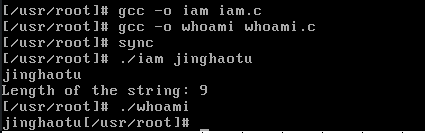
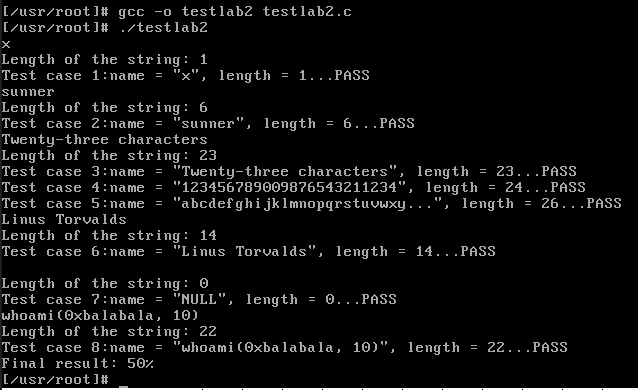
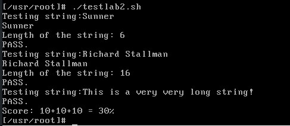

# 操作系统-实验四报告

作者: 013-涂靖昊

总效果如下:

(1) `iam.c` 和 `whoami.c`.
这里用 `printk()` 输出了一些调试用的简单信息.



(2) `testlab2.c`



(3) `testlab2.sh`



## 1 实验过程

### 1.1 Linux 0.11 中的增改

在 `linux-0.11/kernel` 中创建 `who.c` 文件, 添加 `sys_iam()` 和 `iam_whoami()`

具体内容如下:

```c
#include <linux/kernel.h>
#include <../include/asm/segment.h>
#include <unistd.h>
#include <errno.h>

#define MAX_LENGTH 23

char whoami[MAX_LENGTH + 1];
int length;

int sys_iam(const char * name)
{
    int res = -1;
    char* addr = name;
    char ch;
    char tmp[MAX_LENGTH + 1];
    int i;
    for(i = 0; ; i++)
    {
        if(i == MAX_LENGTH + 1)
        {
            errno = EINVAL;
            return res;
        }
        ch = get_fs_byte(addr);
        addr++;
        tmp[i] = ch;
        if(ch == '\0')
        {
            length = i;
            break;
        }
    }

    for(i = 0; i < length + 1; i++)
    {
        whoami[i] = tmp[i];
    }

    // printk("%s\n", whoami);
    // printk("Length of the string: %d\n", length);

    res = length;
    return res;
}

int sys_whoami(char* name, unsigned int size)
{
    int len = 0;
    int res = -1;
    char* addr = name;
    for(; whoami[len] != '\0'; len++)
    {
        if(len > size)
        {
            errno = EINVAL;
            return res;
        }
    }
    int i;
    for(i = 0; i < len; i++)
    {
        put_fs_byte(whoami[i], addr);
        addr++;
    }
    // printk("second_try\n");
    res = len;
    return res;
}
```

然后按照实验指导书中的内容修改 `linux-0.11/kernel` 下的 `Makefile` 即可.

## 1.2 Bochs Linux 中的增改

实验指导书中关于 `/usr/include/unistd.h` 和 `usr/include/linux/sys.h` 在 Bochs Linux 的文件系统中修改.

## 1.3 编写 `iam.c` 和 `whoami.c`

内容如下:

`iam.c`

```c
#include <errno.h>
#define __LIBRARY__
#include <unistd.h>
#include <stdio.h>

_syscall1(int, iam, const char *, name);

int main(int argc, char **argv)
{
    iam(argv[1]);
    return 0;
}
```

`whoami.c`

```c
#include <errno.h>
#define __LIBRARY__
#include <unistd.h>

_syscall2(int, whoami, char *, name, unsigned int, size);

int main() {
  char s[30];
  whoami(s, 30);
  printf("%s", s);
  return 0;
}
```

放在用户目录, 即 `/usr/root` 下即可.

## 2 问题

### 2.1

> 从 `Linux 0.11` 现在的机制看，它的系统调用最多能传递几个参数？

`Linux 0.11` 中系统调用使用的是定义在 `include/unistd.h` 中的 `_syscall0()`, `_syscall1()`, `_syscall2()`
和 `_syscall3()` 这四个函数. 它们分别代表系统调用能传递的参数有 0, 1, 2, 3 个.

这说明 `Linux 0.11` 中, 系统调用最多传递 3 个参数.

> 你能想出办法来扩大这个限制吗？

我们可以模仿 `Linux 0.11` 的设计, 手动编写能传递 5 个参数, 甚至更多参数的 `_syscall*()` 函数.
但这样的方法是繁琐的.

我们也可以选择将参数保存在内存段和堆栈中, 然后通过访问内存段和堆栈来获得参数.

这样带来的一个问题就是我们实验中已经遇到的问题, 就是内核模式和用户模式下访问数据的限制. 不过我们已经学到了可以使用
`put_fs_byte()` 和 `get_fs_byte()` 来解决这个问题.

通过这样的方法, 确实能够扩大这个限制.

> 用文字简要描述向 `Linux 0.11` 添加一个系统调用 `foo()` 的步骤。

1. 编写API函数`foo()`，根据其参数个数调用`syscall0`到`syscall3`这4个宏函数的其中一个，或者手动添加含有`int $0x80`的嵌入汇编代码，通过EAX寄存器传入系统调用号，进入内核
2. 在内核中实现真正的系统调用函数`sys_foo()`，并修改对应的makefile文件
3. 同时在`sys_call_table`中加入`sys_foo()`函数的函数名，即入口地址，在该头文件中声明`sys_foo()`函数
4. 在`include/unistd.h`中定义`sys_foo()`函数的系统调用号
5. 别忘了修改 `kernel/system_call.s` 中代表系统调用总数的变量 `nr_system_calls` 的值
6. 编写测试程序，修改添加了 `foo()` 系统调用的`Linux 0.11`的文件系统下的`unistd.h`文件，加入 `foo()` 的系统调用号，运行测试程序，检验效果.
