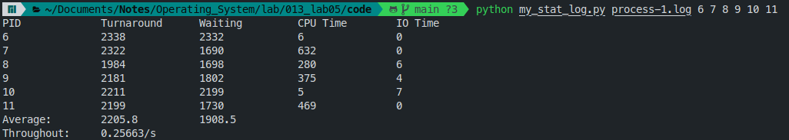

# 操作系统-实验五报告

作者: 013-涂靖昊

## 1 效果展示:

这是终端的运行截图:


这是用自己编写的统计程序 `my_stat_log.py` 计算得到的结果:



这是修改时间片后的结果:


具体 log 文件可以查看 `code` 目录下的 `process-1.log` 和 `process-2.log` 分别对应未修改时间片和修改时间片的日志文件.

## 2 代码实现

### 2.1 添加文件描述符

在 `init/main.c` 的 `init()` 中, 可以在开头看到进程 1 创建了三个文件描述符. 只需要在这个三行代码之后紧跟着创建我们需要的文件描述符即可.

添加代码如下:

```c
(void) open("/var/process.log", O_CREAT|O_TRUNC|O_RDWR, 0666);
```

### 2.2 选择合适的位置输出结果

这里我们需要找到在进程创建以及进程状态修改的地方, 通过已提供的函数 `fprintk` 向 `/var/process.log` 文件输出相应的进程状态切换信息.

这里我们需要在三个文件 `kernel/fork.c`, `kernel/exit.c`, `kernel/sched.c` 中添加输出.

1. 在 `kernel/fork.c` 中, 在 `copy_process()` 中, 可以在函数的中段和结尾分别输出 `N` 和 `J` 信息. 表示进程的创建和就绪.

2. 在 `kernel/exit.c` 中, 需要添加的地方有 `do_exit()` 和 `sys_waitpid()`.

3. 在 `kernel/sched.c` 中, 涉及的函数有 `schedule()`, `sys_pause()`, `sleep_on()`, `interruptible_sleep_on()` 和 `wake_up()`.

在所有修改 `state` 变量之后加上输出即可, 状态和输出的对应如下:

| 状态 | 输出 |
| --- | --- |
| TASK_RUNNING | R |
| TASK_INTERRUPTIBLE | W |
| TASK_UNINTERRUPTIBLE | W |
| TASK_ZOMBIE | E |

值得注意的是: 首先我用 `if` 判断语句去除了所有有关进程 0 的输出; 其次, 在 `kernel/exit.c` 的 `do_exit()` 中需要在函数开头打印 `E` 信息; 最后, 在 `kernel/sched.c` 的 `schedule()` 中, 在执行 `switch_to(next);` 之前需要如下代码:

```c
if (task[next]->pid != current->pid) {
    if (current->state == TASK_RUNNING) {
        // 进程0 -> 其他进程, 此时进程0的状态是 TASK_INTERRUPTIBLE, 所以不会被打印
        fprintk(3, "%ld\t%c\t%ld\n", current->pid, 'J', jiffies);
    }
    // 其他进程 -> 进程0, 则这里能够打印进程0的状态, 不过没有必要
    if (task[next]->pid != 0)
        fprintk(3, "%ld\t%c\t%ld\n", task[next]->pid, 'R', jiffies);
}
```

这里虽然没有对 `state` 进行修改, 但实际上选择下一个时间片运行的进程, 进程的状态从就绪态变为了运行态, 尽管它们对应的 `state` 都是 `TASK_RUNNING`.

此外, 需要排除下一个运行的进程和当前运行的进程是同一个的情况. 因为在这种情况下, 并没有发生实际的进程调度.

### 2.3 修改时间片

根据实验指导书最后一个章节的分析, 我们只需要修改 `include/linux/sched.h` 中 `INIT_TASK` 的 `priority` 的值即可, 也就是第一行三个数中对应 `priority` 的最后一个.

<!-- ## 3 关于写缓存 Bug 的一些阐述和发现(目前未做完, 留待考试结束后再完成)

### 3.1 Bochs 高版本降频操作

在 `bxrc` 文件中添加如下两行即可实现降频:

```bxrc
cpu: ips=1919380
clock: sync=slowdown
```

这两行的意思分别是将所模拟处理器的频率降至 `linux-0.11` 中所配置的 `1919380HZ`,
以及设置模拟时钟与主机时钟一致.

这样能将模拟器的正常运行时间从十几秒延长至几十分钟, 足够完成本实验.

在 Bochs 高版本如 2.6.10 下进行降频, 实验发现运行约 30~40 分钟后依然会触发 `panic()` 报错.

而在高频下执行, 约 15~20s 就会触发 `panic()` 报错.

对比发现, 高频的频率是低频的 100 余倍. 而执行时间恰好也有这样的倍数关系.

同样对比两次输出的 `process.log`, 会发现文件大小都约为 32 MB,
且与 `Linux-0.11` 的 `buffer space` 相当接近.

### 3.2 关于 panic 报错的函数栈跟踪

这里先给出找到的结果, 发生 `panic()` 报错的函数嵌套由外向内依次是:

`fprintk()` $\rightarrow$ `flie_write()` $\rightarrow$ `create_block()`
$\rightarrow$ `_bmap()` $\rightarrow$ `bread()` $\rightarrow$ `wait_on_buffer()`
$\rightarrow$ `sleep_on()` $\rightarrow$ `panic()`

其中 `bread()` 是 `_bmap()` 中第二次出现的 `bread()`, 表明这个时候 `process.log` 已经是一个相当大的文件了, 以至于 `create_block()` 采用了二级引用块的方法来加载 `process.log` 文件.

### 3.3 当前跟踪到的一些结果.

-->

## 3 问题

> 1.结合自己的体会，谈谈从程序设计者的角度看，单进程编程和多进程编程最大的区别是什么？

从程序设计者的角度看，单进程编程和多进程编程的最大区别在于并发性和资源管理。

1. 并发性：在单进程编程中，程序的各个部分按照特定的顺序依次执行。而在多进程编程中，可以创建多个并发的进程，这些进程可以在不同的处理器上同时执行，或者在单个处理器上交替执行。这可以提高程序的性能，特别是在多核处理器系统中。

2. 资源管理：每个进程都有自己的内存空间和系统资源。这意味着在多进程编程中，需要管理进程间的通信，例如通过管道、信号、共享内存等机制。而在单进程编程中，所有的数据和资源都在同一个进程中，可以直接访问。

> 2.你是如何修改时间片的？仅针对样本程序建立的进程，在修改时间片前后， log 文件的统计结果（不包括Graphic）都是什么样？结合你的修改分析一下为什么会这样变化，或者为什么没变化？

方法和结果在前文中已经阐述, 这里不再重复.

我将 `sched.h` 中 `INIT_TASK` 的 `priority` 的值从 15 修改为 255, 增加了时间片的大小.

从前面的结果中可以看到, 执行时间和等待时间都有明显增加, 这说明时间片的增大使得进程的执行时间增加, 减少了进程的切换, 但增加了其他进程的等待时间. 在较大程度地增加时间片的大小的情况下, 进程等待其他资源的消极作用影响更大, 所以使得结果中完成时间有所增加, 吞吐率有所减小.
