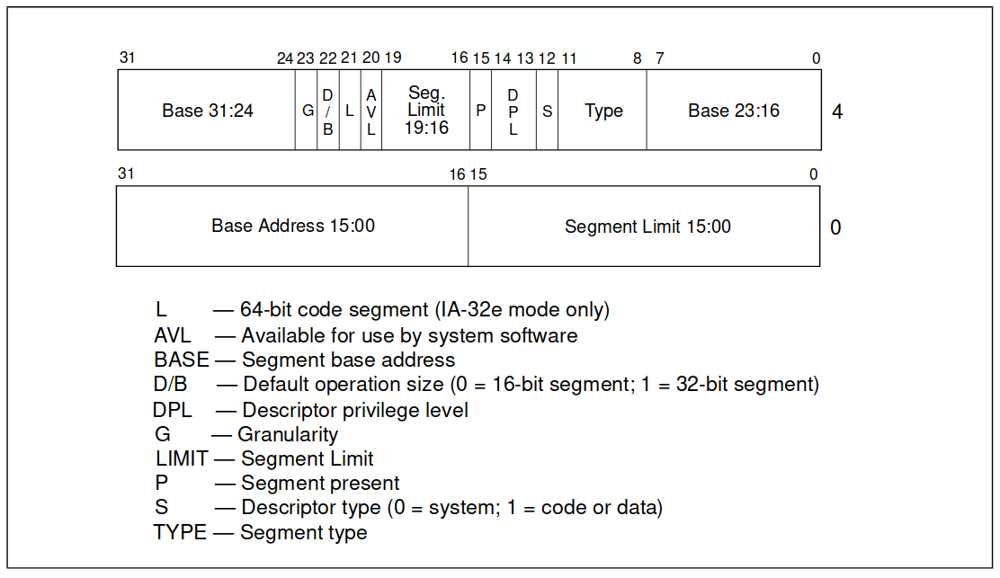

# 2 保护模式内存管理

## 2.1 内存管理概览

<!-- 
了解与掌握以下概念, 并掌握它们之间的转换:
- 逻辑地址 Logical Address
- 线性地址 Linear Address
- 物理地址 Physical Address
有关分段管理的内容
 -->

IA-32 架构的内存管理机制分为两部分: 分段和分页.  
分段提供了一种隔离各个代码, 数据和堆栈模块的机制, 以便多个程序 (或任务) 可以在同一处理器上运行而不会相互干扰.  
分页提供了一种实现传统的按需分页虚拟内存系统的机制, 其中程序执行环境的各个部分根据需要映射到物理内存中. 分页还可以用于提供多个任务之间的隔离.

当在保护模式下运行时, 必须使用某种形式的分段. 没有模式位可以禁用分段. 然而, 分页的使用是可选的.

<figure style="text-align: center;">
  
  <figcaption>分段和分页示意图</figcaption>
</figure>

如图所示, 分段提供了一种将处理器的可寻址内存空间 (称为线性地址空间) 划分为更小的受保护地址空间 (称为段) 的机制.

逻辑地址转换为线性地址:

- 逻辑地址由段选择器和偏移量组成. 段选择器是段的唯一表示符. 除此之外, 它还提供描述符表 (如 GDT) 到称为段描述符的数据结构的偏移量. 每一个段都有一个段描述符, 它指定了段的大小, 段的访问权限和特权级别, 段类型以及该段的第一个字节在线性地址空间中的位置 (称为段的基地址).
- 逻辑地址的片一部分被添加到段的基地址上以定位段内的字节. 基地址加上偏移量就形成了处理器线性地址空间中的线性地址.

线性地址转换为物理地址:

1. 如果不使用分页, 那么处理器的线性地址空间直接映射到处理器的物理地址空间. 物理地址空间定义为处理器可以在其地址总线上生成的地址范围.
2. 分页:
   - 由于多任务计算系统通常定义的线性地址空间远大于一次性包含在物理内存中的经济可行性, 因此需要某种 "虚拟化" 线性地址空间的方法. 线性地址空间的虚拟化是通过处理器的分页机制来处理的.  
   - 分页支持 "虚拟内存" 环境, 其中使用少量物理内存 (RAM 和 ROM) 和一些磁盘存储来模拟大型线性地址空间. 使用分页时, 每个段被分为页 (通常每个大小为 4 KB), 这些页存储在物理内存或磁盘上. 操作系统或执行程序维护一个页目录和一组页表来跟踪页面.
   - 当程序 (或任务) 尝试访问线性地址空间中的地址位置时, 处理器使用页目录和页表将线性地址转换为物理地址, 然后在内存的该地址上执行请求的操作 (读或写).

## 2.2 分段机制

<!-- 
了解以下分段模型:
- Basic Flat Model
- Protected Flat Model
- Multi-Segment Model
 -->

### 2.2.1 Basic Flat Model

Basic Flat Model 是最简单的系统内存模型, 其中操作系统和应用程序可以访问连续的, 未分段的地址空间. 在最大程度上, 这种 Basic Flat Model 向系统设计这和应用程序程序员隐藏了体系结构的分段机制.

<figure style="text-align: center;">
  
  <figcaption>Flat Model</figcaption>
</figure>

要使用 IA-32 架构实现 Basic Flat Model, 必须至少创建 2 个段描述符, 一个用于引用代码段, 另一个用于引用数据段.  
ROM (EPROM) 一般位于物理地址空间的顶部, 因为处理器从 FFFF_FFF0H 开始执行. RAM (DRAM) 被放置在地址空间的底部, 因为复位初始化后 DS 数据段的初始基地址为 0.

### 2.2.2 Protected Flat Model

Protected Flat Model 与 Basic Flat Model 相似, 不同之处在于段限制设置为仅包含物理内存实际存在的地址范围.
如果尝试访问不存在的内存, 则会生成一般保护异常 (#GP). 该模型针对某些类型的程序错误提供了最低级别的硬件保护.

<figure style="text-align: center;">
  
  <figcaption>Protected Flat Model</figcaption>
</figure>

可以向此受保护的平面模型添加更多复杂性, 以提供更多保护. 例如, 对于在用户和管理员代码和数据之间提供隔离的分页机制, 需要定义四个段: 用户的特权级别 3 的代码和数据段, 以及管理员的特权级别 0 的代码和数据段. 通常这些段都相互重叠, 并从线性地址空间中的地址 0 开始. 这种扁平分段模型以及简单的分页结构可以保护操作系统免受应用程序的影响, 并且通过为每个任务或进程添加单独的分页结构, 它还可以保护应用程序免受彼此的影响. 几种流行的多任务操作系统都使用类似的设计.

### 2.2.3 Multi-Segment Model

Multi-Segment Model 使用分段机制的全部功能来提供对代码, 数据结构以及程序和任务的硬件强制保护. 这里, 每个程序 (或任务) 都有自己的段描述符表和自己的段. 这些段对于其分配的程序来说可以是完全私有的, 也可以在程序之间共享. 对系统上运行的各个程序的所有段和执行环境的访问均由硬件控制.

<figure style="text-align: center;">
  
  <figcaption>Multi-Segment Model</figcaption>
</figure>

访问检查不仅可用于防止引用段限制之外的地址, 还可防止在某些段中执行不允许的操作. 例如, 由于代码段被指定为只读段, 因此可以使用硬件来防止写入代码段. 为段创建的访问权限信息还可用于设置保护环或级别. 保护级别可用于保护操作系统过程免遭应用程序未经授权的访问.

## 2.3 逻辑地址和线性地址的转换

<!-- 
重点掌握以下内容:
- 段选择子 Segment Selectors
- 段寄存器 Segment Registers, 以及如何加载它们
- 段描述子 Segment Descriptors, 掌握其结构
掌握以上概念后, 思考如何将逻辑地址转换成线性地址的, 处理器做了几件事?
 -->

逻辑地址由 16 位段选择器和 32 位偏移量组成. 段选择器标识字节所在的段, 偏移量指定字节在段中相对于段基地址的位置. 处理器将每个逻辑地址转换为线性地址. 线性地址是处理器线性地址空间中的 32 位地址. 与物理地址空间一样, 线性地址空间是平坦的 (未分段的) $2^{32}$ 字节地址空间, 地址范围从 0 到 FFFFFFFFH. 线性地址空间包含为系统定义的所有段和系统表.

<figure style="text-align: center;">
  
  <figcaption>逻辑地址和线性地址的转换</figcaption>
</figure>

逻辑地址转换为线性地址的几个步骤:

1. 使用段选择器中的偏移量来定位 GDT 或 LDT 中该段的段描述符, 并将其读入处理器. (只有当新的段选择器加载到段寄存器中时才需要执行此步骤.)
2. 检查段描述符以检查该段的访问权限和范围, 以确保该段可访问并且偏移量在该段的限制内.
3. 将段描述符中的段基地址与偏移量相加, 形成线性地址.

### 2.3.1 段选择器

段选择器是段的 16 位标识符. 它并不直接指向段，而是指向定义该段的段描述符.  
段选择器包含以下内容:

<figure style="text-align: center;">
  
  <figcaption>段选择器</figcaption>
</figure>

- 索引
    : (位 3 到 15) - 选择 GDT 或 LDT 中的 8192 个描述符之一. 处理器将索引值乘以 8 (段描述符中的字节数), 并将结果添加到 GDT 或 LDT 的基地址 (分别来自 GDTR 或 LDTR 寄存器).
- TI (表指示符)
    : 标志 (位 2) - 指定要使用的描述符表: 清除该标志将选择 GDT; 设置此标志将选择当前的 LDT.
- 请求的权限级别 (RPL)
    : (位 0 和 1) - 指定选择器的权限级别. 权限级别的范围为 0 到 3, 其中 0 是最高权限级别.

### 2.3.2 段寄存器

<figure style="text-align: center;">
  
  <figcaption>段寄存器</figcaption>
</figure>

处理器提供了用于保存最多 6 个段选择器的寄存器. 每个段寄存器都支持特定类型的内存引用 (代码, 堆栈或者数据).
实际上, 要执行任何类型的程序, 至少必须向代码段 (CS), 数据段 (DS) 和堆栈段 (SS) 寄存器家在有效的段选择器.
处理器还提供三个附加数据段寄存器 (ES, FS 和 GS), 可用于为当前正在执行的程序 (或任务) 提供附加数据段.
对于要访问段的程序, 该段的段选择器必须已加载到段寄存器之一中.
因此, 尽管系统可以定义数千个段, 但只有 6 个可以立即使用.

通过在程序执行期间将其段选择器加载到这些寄存器中, 可以使其他段可用.

每个段寄存器都有一个 "可见" 部分和一个 "隐藏" 部分.
"可见" 部分存储的是段选择器, "隐藏" 部分存储的是段选择器指向的段描述符中的基地址, 段限制和访问控制信息.

两种指令加载段寄存器:

1. 直接加载指令, 如 MOV, POP, LDS, LES, LSS, LGS 和 LFS 指令. 这些指令显式引用段寄存器.
2. 隐式加载指令, 如 CALL, JMP 和 RET 指令的远指针版本, SYSENTER 和 SYSEXIT 指令以及 IRET, INTn, INTO, INT3 指令. 这些指令更改 CS 寄存器 (有时还更改其他寄存器) 的内容, 作为其操作的附带部分. MOV 指令还可用于将段寄存器的可见部分鄂存储在通用寄存器中.

### 2.3.3 段描述符

段描述符是 GDT 或 LDT 中的数据结构, 它为处理器提供段的大小和位置, 以及访问控制和状态信息. 段描述符通常由编译器, 链接器, 加载器或操作系统或执行程序创建, 但不是应用程序.

<figure style="text-align: center;">
  
  <figcaption>段描述符</figcaption>
</figure>

段描述符包含以下内容: 段限制区, 基地址区, 类型区, S (描述类型) 标志位, DPL 区, P (段显示) 标志位, D/B 标志位,
G (粒度) 符号位, L (64 位代码段) 标志位, 可用保留位.

## 2.4 描述符的分类

<!-- 
重点掌握有关描述符以下内容:
- 数据段描述符 Data Segment Descriptor
- 代码段描述符 Code Segment Descriptor
- 局部描述符表描述符 Local Descriptor-table (LDT) Segment Descriptor
- 任务状态段描述符 Task-state Segment (TSS) Descriptor
- 调用门描述符 Call-gate Descriptor
- 中断门描述符 Interrupt-gate Descriptor
- 陷阱门描述符 Trap-gate Descriptor
- 任务门描述符 Task-gate Descriptor
 -->

描述符是x86架构中用来描述内存段 (segment) 和门 (gate) 的数据结构. 根据不同的用途, 描述符可以分为以下几种类型:

1. 数据段描述符 (Data Segment Descriptor): 用于定义数据段的属性和起始地址, 例如堆、栈等.
2. 代码段描述符 (Code Segment Descriptor): 用于定义代码段的属性和起始地址, 例如程序的指令.
3. 局部描述符表描述符 (Local Descriptor-table (LDT) Segment Descriptor): 用于指向局部描述符表 (LDT), LDT 是一种存储在内存中的描述符表, 可以被进程使用，类似于全局描述符表 (GDT).
4. 任务状态段描述符 (Task-state Segment (TSS) Descriptor): 用于定义任务状态段 (TSS) 的属性和起始地址. TSS 包含了一个任务的状态信息, 例如寄存器值, 段选择子等.
5. 调用门描述符 (Call-gate Descriptor): 用于定义调用门, 调用门是一种门描述符, 可以被调用来执行特定的代码段.
6. 中断门描述符 (Interrupt-gate Descriptor): 用于定义中断门, 中断门是一种门描述符, 用于处理硬件中断或软件中断.
7. 陷阱门描述符 (Trap-gate Descriptor): 用于定义陷阱门, 陷阱门是一种门描述符, 用于捕获和处理异常情况.
8. 任务门描述符 (Task-gate Descriptor): 用于定义任务门, 任务门是一种门描述符, 用于实现任务切换.

每种描述符都有自己特定的格式和字段, 用于描述相关段或门的属性, 访问权限和其他信息. 描述符的使用由操作系统或应用程序来管理和配置.
