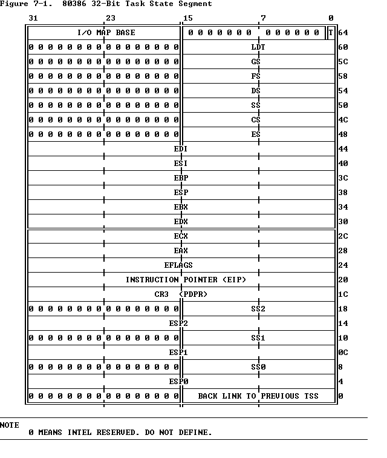
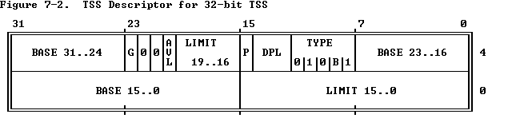
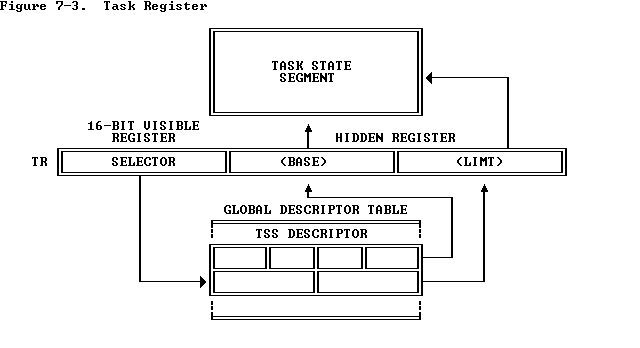
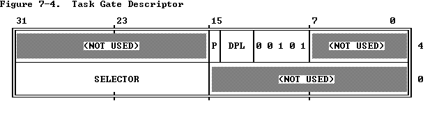
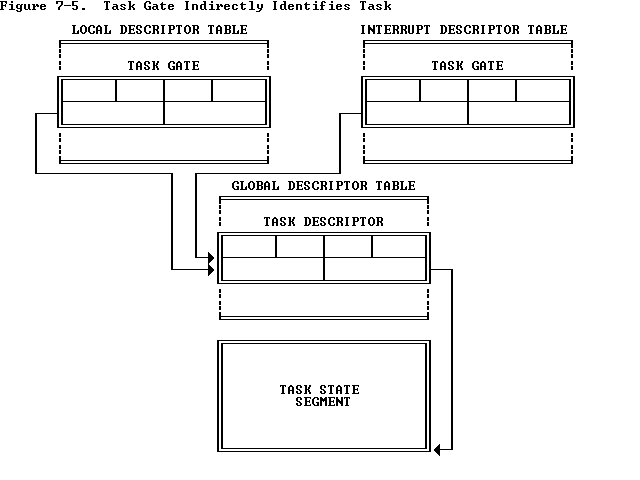
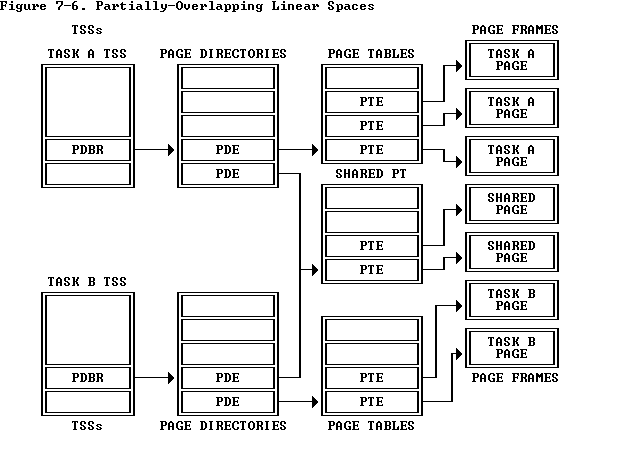

# 4 任务管理

## 4.1 任务管理概述

<!-- 
* 什么是任务?
* 80x86 提供了哪些硬件支持?
* 描述符表中与任务相关额的描述符有哪些?
* 任务切换与过程调用的区别是什么?
 -->

> 什么是任务?

任务是指一个程序的执行过程, 包括代码, 数据和执行状态.

> 80x86 处理器提供了哪些硬件支持?

1. 任务状态段 (TSS): 每一个任务都有一个 TSS, 其中包含了任务的执行状态, 如寄存器的值, 堆栈指针等.
2. 描述符表: 包括有 GDT 和 LDT.
3. 任务切换指令: 任务切换指令包括 JMP, CALL, IRET 等, 用于在任务之间进行切换.
4. 特权级: 80x86处理器支持 4 个特权级, 用于实现任务的保护和隔离.
5. 中断和异常处理: 中断和异常处理机制可以用于在任务之间进行切换, 从而实现任务的异步执行.
6. 内存管理单元 (MMU): MMU 可以将虚拟地址转换为物理地址, 从而实现任务的内存隔离和保护.

> 任务切换与任务调用的区别是什么?

任务调用是指在当前任务内部调用另一个任务的过程, 通常使用 CALL 指令实现. 任务调用不会改变任务的特权级别, 也不会改变任务的状态段和代码段等信息, 只是简单地将控制权转移到另一个任务中执行, 执行完毕后再返回原任务继续执行.

任务切换是指在不同的任务之间进行切换, 通常使用 JMP, IRET 等指令实现. 任务切换会改变任务的特权级别, 状态段和代码段等信息, 因此需要进行一定的上下文切换操作, 如保存当前任务的状态, 加载下一个任务的状态等. 任务切换通常是由操作系统内核进行调度和管理的, 用于实现多任务并发执行.

### 4.1.1 任务结构

<!-- 
* 一个任务由几部分构成?
* 任务执行空间包括什么?
* 为什么会有多个特权级栈空间?
 -->

> 一个任务由几部分组成?

一个任务由以下几部分组成:

1. 任务状态段 (TSS): TSS 包含了任务的执行状态, 如寄存器的值, 堆栈指针等.
2. 代码段和数据段: 代码段和数据段包含了任务的代码和数据.
3. 描述符表: 描述符表中与任务相关的描述符有 GDT 和 LDT.
4. 栈: 每个任务都有自己的栈空间, 用于保存任务执行过程中的临时数据和返回地址.
5. 堆: 堆是任务的动态内存分配区域, 用于存储任务运行时动态分配的内存.
6. 程序计数器 (PC): PC 指向当前任务正在执行的指令.
7. 特权级: 每个任务都有自己的特权级别, 用于实现任务的保护和隔离.
8. 状态标志寄存器 (FLAGS): FLAGS 用于保存任务执行过程中的状态标志, 如进位标志, 零标志等.
9. 堆栈指针 (SP): SP 指向当前任务的栈顶.
10. 任务优先级: 任务优先级用于实现任务的调度和管理, 优先级高的任务先执行.

这些部分共同组成了一个任务的执行空间, 用于存储任务的代码, 数据和执行状态.

> 任务执行空间包括什么?

任务执行空间包括以下内容:

1. 内存空间: 用于存储程序的代码, 数据和堆栈.
2. 寄存器集: 用于存储程序执行过程中的临时数据和指令操作.
3. 文件描述符: 用于访问文件和 I/O 设备.
4. 网络连接: 如果应用程序涉及网络通信, 任务执行空间还包括网络连接相关的资源.
5. 优先级和调度信息: 用于控制任务的执行优先级和调度顺序.
6. 安全权限: 确保进程或线程只能访问其被授权访问的资源, 并防止对系统的非法访问.

> 为什么会有多个特权级栈空间?

每个任务都有自己的特权级, 特权级不同的任务之间不能共享栈空间, 因此需要为每个任务分配一个特权级栈空间.

### 4.1.2 任务状态

<!-- 
* 当前正在执行的任务状态包括哪些内容?
* 掌握每一个被包含内容的含义.
* 为什么要包含这些内容?
 -->

> 当前正在执行的任务状态包括哪些内容?

当前正在执行的任务状态包括以下内容:

1. 任务的特权级: 用于实现任务的保护和隔离.
2. 任务的状态段: 用于保存任务的执行状态, 如寄存器的值, 堆栈指针等.
3. 任务的代码段和数据段: 用于保存任务的代码和数据.
4. 任务的描述符表: 用于保存任务的描述符表, 包括 GDT 和 LDT.
5. 任务的栈: 用于保存任务执行过程中的临时数据和返回地址.
6. 任务的堆: 用于存储任务运行时动态分配的内存.
7. 任务的程序计数器 (PC): 用于指向当前任务正在执行的指令.
8. 任务的状态标志寄存器 (FLAGS): 用于保存任务执行过程中的状态标志, 如进位标志, 零标志等.

> 为什么要包含这些内容?

因为任务的执行需要它们来共同确保任务在操作系统中能够有效地运行并与其他任务隔离开来, 保证系统的稳定性, 安全性和可靠性.

### 4.1.3 任务的执行

<!-- 
* 任务的执行方式有几种?
* 熟悉掌握每一种执行方式的过程
* Linux 0.00 用的是哪种方式?
* 任务可以递归调用吗? 为什么?
 -->

> 任务的执行方式有几种?

任务的执行方式有以下几种:

1. 任务调用: 任务调用是指在当前任务内部调用另一个任务的过程, 通常使用 CALL 指令实现. 任务调用不会改变任务的特权级别, 也不会改变任务的状态段和代码段等信息, 只是简单地将控制权转移到另一个任务中执行, 执行完毕后再返回原任务继续执行.
2. 任务切换: 任务切换是指在不同的任务之间进行切换, 通常使用 JMP, IRET 等指令实现. 任务切换会改变任务的特权级别, 状态段和代码段等信息, 因此需要进行一定的上下文切换操作, 如保存当前任务的状态, 加载下一个任务的状态等. 任务切换通常是由操作系统内核进行调度和管理的, 用于实现多任务并发执行.

> Linux 0.00 用的是哪种方式?

Linux 0.00 用的是任务切换的方式.

> 任务可以递归调用吗? 为什么?

任务可以递归调用, 但是不建议这样做. 因为递归调用会导致任务的堆栈空间不断增长, 从而导致堆栈溢出.

## 4.2 任务的数据结构

<!-- 
* 任务状态段 Task-State Segment (TSS)
* TSS 描述符
* 任务寄存器
* 任务门描述符 Task-Gate Descriptor
 -->

> 任务状态段 Task-State Segment (TSS)

处理器管理任务所需的所有信息都存储在一种特殊类型的段中, 即任务状态段 (TSS). 图7-1显示了执行80386任务的TSS格式.

TSS 的字段属于两类:

1. 处理器随着任务的每次切换而更新的动态集. 该集合包括存储以下字段:
   1. 通用寄存器 (EAX, ECX, EDX, EBX, ESP, EBP, ESI, EDI).
   2. 段寄存器 (ES, CS, SS, DS, FS, GS).
   3. 标志寄存器 (EFLAGS).
   4. 指令指针 (EIP).
   5. 先前执行任务的 TSS 选择器 (仅在预期返回时更新).
2. 处理器读取但不更改的静态集. 该集合包括存储以下字段:
   1. 任务的 LDT 选择器.
   2. 包含任务页目录基地址的寄存器 (PDBR) (仅在启用分页时只读).
   3. 指向特权级别 0-2 的堆栈的指针.
   4. T 位 (调试陷阱位), 当任务切换发生时, 它会导致处理器引发调试异常.
   5. I/O 映射库.

任务状态段可以驻留在线性空间中的任何位置. 唯一需要小心的情况是当 TSS 跨越页面边界并且较高地址的页面不存在时. 在这种情况下, 如果处理器在任务切换期间读取 TSS 时遇到不存在的页面, 则会引发异常. 可以通过以下两种策略之一来避免这种异常:

1. 通过分配 TSS 使其不跨越页面边界.
2. 通过确保任务切换时两个页面都存在或都不存在. 如果两个页面都不存在, 则页面错误处理程序必须在重新启动导致任务切换的指令之前使两个页面都存在.

> TSS 描述符

TSS 可以驻留在内存中的任何位置. 称为任务寄存器 (TR) 的段寄存器包含一个段选择器, 该段选择器指向驻留在 GDT 中的有效 TSS 段描述符 (TSS 描述符可能不驻留在 LDT 中). 因此, 要使用 TSS, 操作系统内核必须完成以下操作:

1. 在 GDT 中创建 TSS 描述符条目
2. 使用该段的段选择器加载 TR
3. 根据需要向内存中的 TSS 添加信息

出于安全目的, TSS 应放置在只能由内核访问的内存中.

> 任务寄存器

任务寄存器 (TR) 通过指向 TSS 来标识当前正在执行的任务. 处理器访问当前TSS的路径如图7-3所示.
任务寄存器具有"可见"部分 (即, 可以由指令读取和更改) 和"不可见"部分 (由处理器维护以对应于可见部分; 不能由任何指令读取). 可见部分的选择器选择 GDT 中的一个 TSS 描述符. 处理器使用不可见部分来缓存 TSS 描述符中的基值和限制值. 将基址和限制保存在寄存器中可以提高任务的执行效率, 因为处理器在引用当前任务的 TSS 时不需要重复从内存中获取这些值.

指令 LTR 和 STR 用于修改和读取任务寄存器的可见部分. 两条指令均采用一个操作数, 即位于内存或通用寄存器中的 16 位选择器.

LTR (加载任务寄存器) 使用选择器操作数加载任务寄存器的可见部分, 该操作数必须选择 GDT 中的 TSS 描述符. LTR 还使用操作数选择的 TSS 描述符中的信息加载不可见部分.
LTR 是一条特权指令; 仅当 CPL 为零时才可以执行.
LTR 一般用在系统初始化时, 给任务寄存器赋一个初值; 此后, TR 的内容通过任务切换操作而改变.

STR (存储任务寄存器) 将任务寄存器的可见部分存储在通用寄存器或内存字中. STR 没有特权.

> 任务门描述符 Task-Gate Descriptor

任务门描述符提供对 TSS 的间接, 受保护的引用. 图 7-4 说明了任务门的格式.
任务门的 SELECTOR 字段必须引用 TSS 描述符. 处理器不使用该选择器中的 RPL 值.

任务门的 DPL 字段控制使用描述符引起任务切换的权限. 除非选择器的 RPL 和过程的 CPL 的最大值在数值上小于或等于描述符的 DPL, 否则过程不能选择任务门描述符. 此约束可防止不受信任的过程导致任务切换.(请注意, 当使用任务门时, 目标 TSS 描述符的 DPL 不用于特权检查.)

有权访问任务门的过程有能力引起任务切换, 就像有权访问 TSS 描述符的过程一样.除了 TSS 描述符之外, 80386 还具有任务门来满足三个需求:

1. 任务需要有一个忙碌位. 由于忙位存储在 TSS 描述符中, 因此每个任务只能有一个这样的描述符. 然而, 可能有多个任务门选择单个 TSS 描述符.
2. 需要提供对任务的选择性访问. 任务门满足了这一需求, 因为它们可以驻留在 LDT 中, 并且可以具有与 TSS 描述符的 DPL 不同的 DPL. 没有足够权限使用 GDT 中的 TSS 描述符的过程 (通常 DPL 为 0) 如果可以访问其 LDT 中该任务的任务门, 则仍然可以切换到另一个任务. 通过任务门, 系统软件可以限制导致任务切换到特定任务的权利.
3. 需要中断或异常来引起任务切换. 任务门也可能驻留在 IDT 中, 使得中断和异常可以引起任务切换. 当中断或异常引导至包含任务门的 IDT 条目时, 80386 会切换到指示的任务. 因此, 系统中的所有任务都可以受益于与中断任务隔离所提供的保护.
图 7-5 说明了 LDT 中的任务门和 IDT 中的任务门如何识别同一任务.

## 4.3 任务切换

<!-- 
此部分内容重点掌握:
* 什么时候发生任务切换?
* 发生任务切换时, 处理器会执行哪些操作?
* 中断或异常向量指向 IDT 表中的中断门或陷阱门, 会发生任务切换吗?
 -->

> 什么时候发生任务切换?

在以下四种情况中的任何一种情况下, 80x86 都会将执行切换到另一个任务:

1. 当前任务执行引用 TSS 描述符的 JMP 或 CALL.
2. 当前任务执行引用任务门的 JMP 或 CALL.
3. 中断或异常向量到 IDT 中的任务门.
4. 当 NT 标志置位时, 当前任务执行 IRET.

> 发生任务切换时, 处理器会执行哪些操作?

任务切换操作包括以下步骤:

1. 检查当前任务是否允许切换到指定任务. 数据访问权限规则适用于 JMP 或 CALL 指令. TSS 描述符或任务门的 DPL 在数值上必须大于或等于门选择器的 CPL 和 RPL 的最大值 (例如, 较低的特权级别). 无论目标任务门的 DPL 或 TSS 描述符如何, 都允许异常, 中断和 IRET 来切换任务.
2. 检查新任务的 TSS 描述符是否标记为存在并且具有有效限制. 到目前为止, 任何错误都发生在传出任务的上下文中. 错误是可重新启动的, 并且可以以对应用程序过程透明的方式进行处理.
3. 保存当前任务的状态. 处理器找到任务寄存器中缓存的当前 TSS 的基地址. 它将寄存器复制到当前的 TSS (EAX, ECX, EDX, EBX, ESP, EBP, ESI, EDI, ES, CS, SS, DS, FS, GS 和标志寄存器). TSS 的 EIP 字段指向导致任务切换的指令之后的指令.
4. 使用传入任务的 TSS 描述符的选择器加载任务寄存器, 将传入任务的 TSS 描述符标记为忙, 并设置 MSW 的 TS (任务切换) 位. 选择器要么是控制传输指令的操作数, 要么取自任务门.
5. 从 TSS 加载传入任务的状态并恢复执行. 加载的寄存器是 LDT 寄存器; 标志寄存器; 通用寄存器 EIP, EAX, ECX, EDX, EBX, ESP, EBP, ESI, EDI; 段寄存器 ES, CS, SS, DS, FS 和 GS; 和 PDBR. 此步骤中检测到的任何错误都发生在传入任务的上下文中. 对于异常处理程序来说, 新任务的第一条指令似乎尚未执行.

> 中断或异常向量指向 IDT 表中的中断门或陷阱门, 会发生任务切换吗?

当异常或中断引导至 IDT 中的任务门时, 会导致任务切换. 如果它指向 IDT 中的中断或陷阱门, 则不会发生任务切换.

## 4.4 任务链

<!-- 
* 如何判断任务是否嵌套?
* 什么情况会发生任务嵌套?
* 任务嵌套时修改了哪些标志位?
* 任务嵌套时, 如何返回前一级任务?
 -->

> 如何判断任务是否嵌套?

TSS 中设置了反向链接字段, NT 位 (nested task) 和 B 位 (busy), 用于判断任务是否嵌套.

1. 反向链接字段: 反向链接字段包含了前一级任务的 TSS 选择器, 用于返回前一级任务.
2. NT 位: NT 位用于标识反向链接字段是否有效.
3. B 位: B 位用于确保反向链路的完整性.

> 什么情况会发生任务嵌套?

任务切换到其自身或反向链接链上的任何任务时, 就会发生任务嵌套.

> 任务嵌套时修改了哪些标志位?

修改了 NT 位和 B 位.

## 4.5 任务地址空间

<!-- 
* 什么是任务地址空间?
* 任务地址空间包括什么?
* 了解把任务映射到线性和物理地址空间的方法.
* 了解任务逻辑地址空间, 及如何在任务之间共享数据的方法.
 -->

> 什么是任务地址空间?

任务地址空间是 80x86 处理器分配给不同任务的共享地址空间区域的不同区域 (可能存在交集, 即不同任务之间存在一定程度的地址空间共享).

> 任务地址空间包括什么?

任务地址空间包括适当选择的段和页映射.

> 了解把任务映射到线性和物理地址空间的方法.

大致有两类:

1. 所有任务共享一种线性到物理的映射:
    当未启用分页时, 这是唯一的可能性. 如果没有页表, 所有线性地址都映射到相同的物理地址.
    启用分页后, 这种类型的线性到物理映射是由于对所有任务使用一个页面目录而产生的. 如果操作系统也实现页级虚拟内存, 则所利用的线性空间可能会超过可用的物理空间.
2. 几个部分重叠的线性到物理映射:
    这种风格是通过为每个任务使用不同的页面目录来实现的. 由于 PDBR (页目录基址寄存器) 是在每次任务切换时从 TSS 加载的, 因此每个任务可能具有不同的页目录.

理论上, 不同任务的线性地址空间可以映射到完全不同的物理地址. 如果不同页目录的条目指向不同的页表, 并且页表指向物理内存的不同页, 则任务不共享任何物理地址.

实际上, 所有任务的线性地址空间的某些部分必须映​​射到相同的物理地址. 任务状态段必须位于公共空间中, 以便处理器在任务切换期间读取和更新 TSS 时, TSS 地址的映射不会更改. GDT 映射的线性空间也应该映射到公共物理空间; 否则, GDT 的目的就落空了. 图 7-6 显示了两个任务的线性空间如何通过共享页表在物理空间中重叠.

> 了解任务逻辑地址空间, 及如何在任务之间共享数据的方法.

就其本身而言, 公共线性到物理空间映射并不能实现任务之间的数据共享. 为了共享数据, 任务还必须具有共同的逻辑到线性空间映射; 即, 它们还必须能够访问指向共享线性地址空间的描述符. 可通过三种方法创建常见的逻辑到物理地址空间映射:

1. 通过 GDT. 所有任务都可以访问 GDT 中的描述符. 如果这些描述符指向映射到所有任务的公共物理地址空间的线性地址空间, 则任务可以共享数据和指令.
2. 通过共享 LDT. 如果两个或多个任务的 TSS 中的 LDT 选择器选择相同的 LDT 段, 则它们可以使用相同的 LDT. 那些指向映射到公共物理空间的线性空间的 LDT 驻留描述符允许任务共享物理内存. 这种共享方式比 GDT 共享更有选择性; 共享可以仅限于特定任务. 系统中的其他任务可能具有不同的 LDT, 这些 LDT 不允许它们访问共享区域.
3. 通过 LDT 中的描述符别名. 不同 LDT 的某些描述符有可能指向相同的线性地址空间. 如果通过所涉及任务的页映射将该线性地址空间映射到相同的物理空间, 则这些描述符允许任务共享公共空间. 此类描述符通常称为 "别名". 这种分享方式比前两种方式更具选择性; LDT 中的其他描述符可能指向不同的线性地址或不共享的线性地址.
